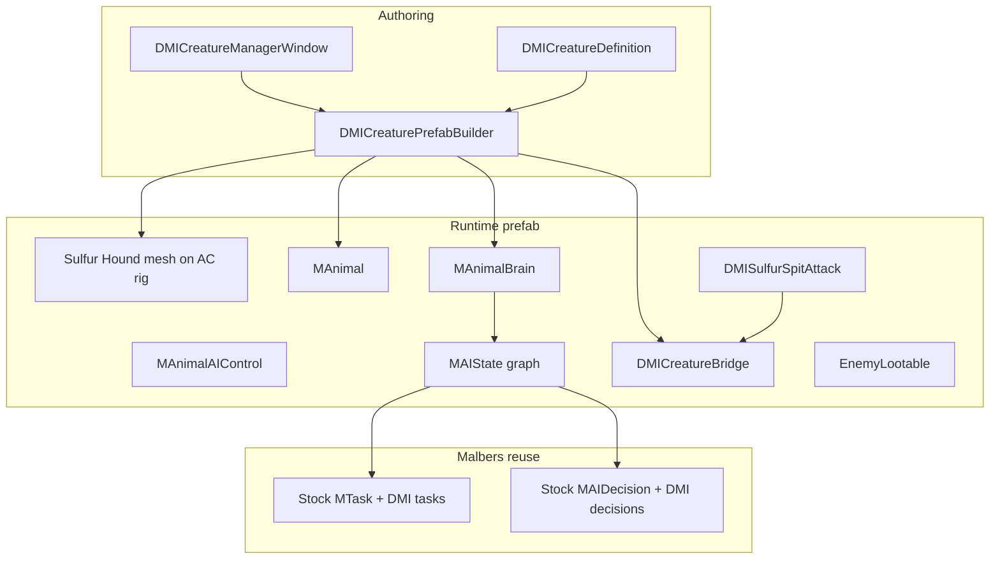

# DMI Creatures Manager (Malbers Animal Controller)

**Status:** Active — Houndv3 OnWolf primary wired (`Sulfur_Hound.prefab`, AutoReskin OFF)  
**Product:** Dark Matter: Genesis  
**First creature:** Sulfur Hound (quadruped enemy)

---

## Locked decisions

| Decision | Choice |
|----------|--------|
| Locomotion / animation | Malbers **`MAnimal`** + AC Animator (Wolf Lite / Empty Controller) |
| AI | Malbers **`MAnimalBrain`** + **`MAIState`** graphs |
| Reuse | Stock Malbers **Tasks / Decisions** + new **`DMI*`** subclasses |
| Our code | All new scripts **`DMI...`** under `Assets/_Project/` — compose Malbers, **do not edit** Malbers package sources |
| Tools | New **Creatures Manager** window (humanoids stay Enemy Prefab Creator / Invector) |
| Mesh bind | **Blender OnWolf (active):** Data Transfer Sulfur mesh → Wolf Lite bones → `Sulfur_Hound_OnWolf.fbx` — see [`sulfur_hound_blender_wolf_reskin.plan.md`](sulfur_hound_blender_wolf_reskin.plan.md). Not Blink / AutoReskin / Max Skin Wrap. |
| Cinemachine bridge | Stays disabled (`MALBERS_ENABLE_CINEMACHINE_BRIDGE`) |

Docs: [Malbers Animal Controller](https://malbersanimations.gitbook.io/animal-controller/)

---

## Why remake (vs earlier Showcase-only plan)

With **Animal Controller** + **Common** installed we now have:

- [`MAnimal`](Assets/Malbers%20Animations/Common/Scripts/Animal%20Controller/MAnimal.cs) — Move, Mode_Activate, Stance, States
- [`MAnimalAIControl`](Assets/Malbers%20Animations/Common/Scripts/Animal%20Controller/MAnimalAIControl.cs) — NavMesh bridge → `animal.Move`
- [`MAnimalBrain`](Assets/Malbers%20Animations/Common/Scripts/Animal%20Controller/AI%20Brain/MAnimalBrain.cs) — pluggable AI
- [`MTask`](Assets/Malbers%20Animations/Common/Scripts/Animal%20Controller/AI%20Brain/MTask.cs) / [`MAIDecision`](Assets/Malbers%20Animations/Common/Scripts/Animal%20Controller/AI%20Brain/MAIDecision.cs) + 22 tasks / 19 decisions
- [`Wolf Lite AI Enemy.prefab`](Assets/Malbers%20Animations/Animal%20Controller/Wolf%20Lite/) + Brain assets (`AC 01 Patrol`, `AC 02 Attack and Kill`, `AC 03 Find who Hurt me`)
- [`Empty Controller`](Assets/Malbers%20Animations/Animal%20Controller/Empty%20Controller/) scaffold for custom creatures

Showcase.controller alone is no longer the primary path — AC Modes/States + Brain are.

---

## Architecture



**Rule:** Malbers owns move / modes / stances / brain ticks. DMI owns DM damage, loot, encounters, spit targeting, and prefab authoring.

---

## Folder layout

```
Assets/_Project/Scripts/Creatures/
  DMICreatureDefinition.cs
  DMICreatureBridge.cs
  DMICreatureHealth.cs
  DMICreatureTargetResolver.cs
  DMISulfurSpitAttack.cs
  DMISulfurSpitProjectile.cs
  Brain/
    DMISetThreatTargetTask.cs          : MTask
    DMISpitSpecialTask.cs              : MTask
    DMIInPlayerViewDecision.cs         : MAIDecision
    DMIIsValidSpitTargetDecision.cs    : MAIDecision
    DMIChanceWeightedDecision.cs       : MAIDecision
Assets/_Project/Editor/Creatures/
  DMICreatureManagerWindow.cs
  DMICreaturePrefabBuilder.cs
Assets/_Project/Data/Creatures/
  SulfurHound.asset
  Brain/                               # MAIState assets
Assets/_Project/Prefabs/Creatures/
  Sulfur_Hound.prefab
```

---

## Phase 0 — Definition + folders

1. Create `DMICreatureDefinition` (ScriptableObject): id, displayName, prefab name, visual source, AC template (Wolf Lite AI Enemy / Empty Controller), start `MAIState`, health/XP/loot, spit tuning (base chance, view-boosted chance, range, cooldown, damage).
2. Creatures stay on their own definition (not forced through `EnemyDefinition` Invector path). Encounter tables reference the built prefab + `SurfaceThreatKind.Lifeform`.
3. Menu: **Dark Matter / Creatures / Creature Manager**.

## Phase 1 — Prefab builder (Sulfur Hound)

1. Clone / instantiate from **Wolf Lite AI Enemy** (has `MAnimal` + `MAnimalAIControl` + `MAnimalBrain`).
2. Bind **authored** Sulfur-on-Wolf mesh (`Sulfur_Hound_OnWolf.fbx` from Blender weight transfer) + materials onto AC Generic wolf rig — do not use Unity AutoReskin.
3. Duplicate controllers/materials into `_Project` — never overwrite Malbers assets.
4. `DMICreaturePrefabBuilder` adds DMI bridge, health adapter, spit, loot/disintegrate hooks.
5. Save `Assets/_Project/Prefabs/Creatures/Sulfur_Hound.prefab`.

## Phase 2 — Combat bridge

`DMICreatureBridge`:

- Caches `MAnimal`, `MAnimalBrain`, `MAnimalAIControl`.
- `DMICreatureTargetResolver` sets `brain.Target` to player / pet / companions / other creatures (**exclude** Sulfur Hound allies).
- Route Malbers damage ↔ project `IDamageable` / `CombatHitResolver`.
- Death → AC Death state → loot / disintegrate.

**Reuse stock Malbers:** `PatrolTask`, `SetDestinationTask`, `PlayModeTask` (bites), `SetTargetTask`, `ChanceTask`, `LookDecision`, `ArriveDecision`, Wolf Lite Brain assets as graph templates.

## Phase 3 — Brain graph + spit

Project `MAIState` assets under `Data/Creatures/Brain/`:

| State | Tasks / decisions |
|-------|-------------------|
| Patrol | Stock `PatrolTask` |
| Chase | `DMISetThreatTargetTask` + `SetDestinationTask` |
| Melee | `PlayModeTask` (bite/paw ModeIDs) |
| Spit | `DMISpitSpecialTask` when valid target + chance |
| Hurt | Pattern from Wolf Lite `AC 03 Find who Hurt me` |

**Spit lock:**

- Green liquid/gas `DMISulfurSpitProjectile`.
- Targets: player, pets, companions, non-hound creatures.
- Low base chance; **higher** when target is in **player camera frustum**.
- Cooldown + range on definition.

## Phase 4 — Creature Manager window

`DMICreatureManagerWindow`:

- CRUD `DMICreatureDefinition`.
- Visual: hierarchy selection (Sulfur Hound) or FBX.
- AC template + start brain + spit/loot fields.
- **Build / Rebuild / Place in Scene / Open Brain**.

## Phase 5 — World wire-up

- Register prefab in surface encounter / B1 Lifeform table.
- Ecology roster: Sulfur Hound prototype → Malbers AC + DMI brain (not deferred legacy AI).
- Quadruped collider + NavMesh agent check.
- Console clean (CM bridge stays off).

---

## Out of scope

- All fauna packs / full B1–B7 roster
- Humanoid → Malbers migration
- Enabling Malbers Cinemachine bridge
- Editing Malbers package C# (wrappers only)

---

## Acceptance

- [x] Sulfur Hound prefab built from Wolf Lite AI Enemy + Houndv3 OnWolf mesh (AutoReskin OFF)
- [x] Definition + brain + B1 encounter wired (`Sulfur_Hound.prefab` spawn-ready)
- [ ] Playtest: Sulfur Hound patrols / chases / melees via Malbers brain
- [ ] Playtest: Spit hits valid targets with view-boosted chance
- [x] All new scripts are `DMI*` under `_Project`
- [x] Creature Manager rebuilds prefab from definition (OnWolf path)
- [x] No Malbers source edits; no CS errors from this rebuild

---

## Implementation todos

1. ~~Scaffold `DMICreatureDefinition` + Creatures script/editor folders~~  
2. ~~Prefab builder: Wolf Lite AI Enemy + Houndv3 OnWolf mesh + DMI components~~  
3. ~~`DMICreatureBridge` + health/damage/loot adapters~~  
4. ~~DMI Tasks/Decisions + Sulfur Hound `MAIState` graph~~  
5. ~~Spit attack + projectile~~  
6. ~~`DMICreatureManagerWindow`~~  
7. ~~Encounter table + roster note~~  
8. Play Mode: patrol / chase / melee / spit on Houndv3 mesh  

---

*Dark Matter Studios — Dark Matter: Genesis — Creatures Plan*
