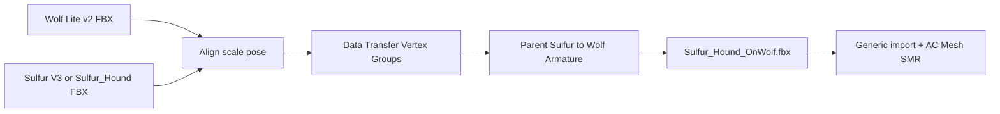

# Sulfur Hound → Wolf Lite — Blender Weight Transfer (Active Path)

**Status:** Phase 1+ rebuilt on Combat `Houndv3.fbx` (July 2026) — primary AC path live; Play Mode still to verify  
**Product:** Dark Matter: Genesis  
**Track name:** **V2-B / Blender OnWolf** (Malbers Wolf Lite armature + Sulfur look)  
**Supersedes for this goal:** Blink Skinned Mesh Transfer, Cascadian name-remap, Unity `DMICreatureAutoReskin`, 3ds Max Skin Wrap, V2-A-only

**Related plans:**
- [`dmi_creatures_manager_malbers.plan.md`](dmi_creatures_manager_malbers.plan.md) — AC + brain + DMI bridge (keep)
- User Cursor plan `sulfur_hound_v2_8a5cfb52.plan.md` — V2-A Meshy-native remains an alternate if Blender is deferred

---

## Locked decisions

| Decision | Choice |
|----------|--------|
| Goal | Sulfur Hound **look** driven by **Malbers Wolf Lite** bones so AC walk/run/attack/death work |
| DCC | **Blender** — Data Transfer / Transfer Weights (not name remap) |
| Animation skeleton | Malbers **Wolf Lite** Generic hierarchy (`Pelvis`, `L Thigh`, `R UpperArm`, …) |
| Mesh donor | **Sulfur Hound V3** FBX (preferred) or `Sulfur_Hound.fbx` |
| Unity Mecanim | **Generic** only — never Humanoid for this path |
| Runtime stack | Existing **Wolf Lite AI Enemy** + `MAnimal` / Brain / `DMICreatureBridge` / spit |
| Naming | Export + prefab under `Assets/_Project/` with **DM/DMI** names |
| Out of scope | Blink/Cascadian, AutoReskin spaghetti, editing Malbers package sources |

### Why Blender (not Blink / Max / AutoReskin)

- **Blink / Cascadian:** remap by **bone name** only. Sulfur bones ≠ Wolf bones → fails or spaghetti.
- **Unity AutoReskin:** closest-point rebind produced inverted winding / broken deformation.
- **3ds Max Skin Wrap:** valid idea, painful in practice for this pair.
- **Blender Data Transfer:** copies **vertex weights** from Wolf proxy mesh → Sulfur mesh onto the **Wolf armature** — the real fix.



---

## Exact assets to import in Blender

### Armature + weight-source mesh (donor)

| Role | Path |
|------|------|
| **Preferred** (avatar used by Wolf Lite prefab) | `Assets/Malbers Animations/Animal Controller/Wolf Lite/Wolf Lite v2.fbx` |
| Alternate (smaller / same bone names) | `Assets/Malbers Animations/Animal Controller/Wolf Lite/Wolf Lite.FBX` |

Use **one** Wolf FBX. Keep its armature + skinned mesh. Do **not** import animation takes for the bind file (bind pose only).

### Sulfur mesh donor (donee look)

| Preference | Path |
|------------|------|
| **Best look (V3)** | `Assets/_Project/Prefabs/Environment/Lifeforms Low Level/Sulfur Hound V3/Meshy_AI_Cragscale_Emberwyrm_0729233726_texture.fbx` |
| Fallback | `Assets/_Project/Prefabs/Environment/Lifeforms Low Level/Sulfur_Hound_01/Meshy_AI_Cragscale_Emberwyrm_quadruped/Sulfur_Hound.fbx` |
| Alt | `…/Sulfur Hound v1.fbx` |

**Textures (V3):** same folder — `…_texture.png`, `_normal`, `_metallic`, `_roughness`.

### Missing / do not wait on

| Asset | Status |
|-------|--------|
| `Meshy_AI_Cragscale_Emberwyrm_quadruped_Character_output.fbx` | **Missing from disk** — older plans referenced it; use **V3** or `Sulfur_Hound.fbx` instead |
| UniRig GLB (`Sulfur Hound V2.glb`) | Wrong bone names (`Bone_###`) — mesh-only if desperate; prefer FBX |

### Unity template after export

| Role | Path |
|------|------|
| AC template | `Assets/Malbers Animations/Animal Controller/Wolf Lite/Wolf Lite AI Enemy.prefab` |
| Body mat (project) | `Assets/_Project/Materials/Creatures/Sulfur_Hound_Body_Unlit.mat` (or Lit once normals OK) |
| Legacy broken reskin meshes | `Assets/_Project/Meshes/Creatures/Sulfur_Hound_ACSkinned.asset` — **do not reuse** |

---

## Blender step-by-step

### 0. Prep

1. Blender 3.6+ or 4.x with FBX import/export enabled.
2. Work in a throwaway `.blend` (e.g. `Sulfur_Hound_OnWolf.blend`) outside or under `_Project/Documentation/` — do not clutter Malbers folders.
3. Units: Metric, Unit Scale **1.0**. Match Unity later via FBX scale.

### 1. Import Wolf (armature + proxy mesh)

1. **File → Import → FBX** → `Wolf Lite v2.fbx`.
2. Import options (typical):
   - Automatic Bone Orientation **off** (or test if bones look wrong)
   - Ignore Leaf Bones **on** if extra tips appear
   - Animation **off**
3. Confirm hierarchy includes **`Pelvis`**, spine/neck/head, `L/R Thigh|Calf|Foot`, `L/R UpperArm|Forearm|Hand`, tail/ears as in Wolf Lite.
4. Rename collection to `Wolf_Donor`. Keep the Wolf **skinned mesh** visible — it is the weight source.

### 2. Import Sulfur (mesh donor)

1. **File → Import → FBX** → V3 texture FBX (or `Sulfur_Hound.fbx`).
2. Animation **off**.
3. If Sulfur brings its own armature: you only need the **mesh object(s)**. You will discard Sulfur bones after transfer.
4. Rename Sulfur mesh to `Sulfur_Hound_Mesh`.

### 3. Align / scale (critical)

1. Put both in **Object Mode**, world origin shared.
2. Scale Sulfur so:
   - Chest/hips sit over **Pelvis**
   - Feet near Wolf feet
   - Snout near Wolf head / Jaw
3. Prefer **uniform scale** on the mesh object; apply with **Ctrl+A → Scale** (and Rotation if needed) so modifiers see clean data.
4. Optional: lightly pose Wolf armature to a T/A bind closer to Sulfur rest — then **Apply Pose as Rest Pose** only if you understand it changes bind; default is leave Wolf bind pose as shipped.
5. Do **not** apply location to bones casually; keep Wolf armature transforms clean.

### 4. Transfer weights (Data Transfer)

Goal: Sulfur mesh gets **vertex groups named exactly like Wolf bones**, with weights sampled from the Wolf mesh.

**Method A — Data Transfer modifier (recommended)**

1. Select **Sulfur_Hound_Mesh**, add modifier **Data Transfer**.
2. Source Object = **Wolf skinned mesh**.
3. Enable **Vertex Data → Vertex Groups**.
4. Mapping: **Nearest Face Interpolated** (or Nearest Vertex if meshes are very close).
5. Generate Data Layers: **All Layers** / mix mode **Replace**.
6. **Apply** the modifier.
7. Check Weight Paint: groups like `Pelvis`, `L Thigh`, `R UpperArm` should exist and paint cleanly.

**Method B — Transfer Weights operator**

1. Select Wolf mesh, then Sulfur mesh (active).
2. Weight Paint → **Weights → Transfer Weights** (or Object Data Properties → Vertex Groups → Transfer).
3. Source layers → By Name; destination → All.
4. Same mapping as above.

**If Sulfur still has old groups** (`Hips`, `char1_*`, `Bone_###`): delete those groups after transfer so only Wolf names remain.

### 5. Bind Sulfur to Wolf armature

1. Select `Sulfur_Hound_Mesh`, then Wolf **Armature**, **Ctrl+P → Armature Deform → With Empty Groups** is wrong if groups already exist — use:
   - Add **Armature** modifier on Sulfur → Object = Wolf armature
   - Or **Parent → Armature Deform** without empty groups if groups already match
2. Confirm Armature modifier uses the transferred vertex groups (Bind To: Vertex Groups).
3. Delete / hide Sulfur’s old armature object.
4. **Test:** pose Wolf bones in Pose Mode — Sulfur legs/body should follow without spaghetti. Fix bad areas with Weight Paint / Smooth / Normalize All.

### 6. Cleanup before export

1. Delete Wolf **proxy mesh** (optional but cleaner) — keep **Armature + Sulfur mesh** only.
2. Ensure single root sensible for Unity (often armature as root, mesh child).
3. Apply mesh scale/rotation; leave armature scale at 1 if possible.
4. No shape keys required for v1.
5. Materials: can keep placeholder; Unity will assign project mats.

### 7. Export FBX

1. Select Armature + Sulfur mesh.
2. **File → Export → FBX**
3. Suggested settings:
   - Selected Objects **on**
   - Scale **1.0** (tune if Unity comes in huge/tiny)
   - Apply Scalings: **FBX All** or **FBX Units Scale**
   - Forward **-Z**, Up **Y**
   - Bake Animation **off**
   - Add Leaf Bones **off**
   - Armature → Only Deform Bones **on**
4. Save as:

```
Assets/_Project/Prefabs/Combat/Houndv3.fbx
```

(Shipped primary OnWolf visual — also acceptable: `Assets/_Project/Meshes/Creatures/Sulfur_Hound_OnWolf.fbx`. Create folder if needed; Unity will generate `.meta`.)

**Do not** use `Assets/_Project/Prefabs/Environment/Lifeforms Low Level/Houndv3.fbx` — that copy is a static MeshFilter mesh without Wolf armature.

---

## Unity post-export steps

### 1. Import settings

1. Select `Sulfur_Hound_OnWolf.fbx`.
2. **Rig:** Animation Type = **Generic**, Avatar Definition = Create From This Model (or Copy From `Wolf Lite v2`).
3. **Animation:** Import Animation **off** for this bind FBX.
4. **Materials:** None / Use External — assign project mats later.
5. Scale: start at **1**; compare to Lifeforms prefab **0.6** and Wolf Lite in scene; adjust `Scale Factor` or prefab transform.

### 2. Wire onto Malbers AC prefab

**Preferred (Creatures Manager):**

1. Point `DMICreatureDefinition` visual source at `Sulfur_Hound_OnWolf.fbx` (or a thin visual prefab).
2. Ensure build track uses **Wolf Lite AI Enemy** (not MeshyNative V2A).
3. **Disable AutoReskin** for this build — mesh is already Wolf-weighted.
4. Builder should assign the OnWolf skinned mesh to the AC **`Mesh`** `SkinnedMeshRenderer` (same bones as template), hide/remove old Wolf proxy mesh and any `Sulfur_Hound_Visual` with foreign armature.
5. Rebuild → `Assets/_Project/Prefabs/Creatures/Sulfur_Hound.prefab` (or `Sulfur_Hound_OnWolf.prefab` if you want a distinct name).

**Manual:**

1. Duplicate `Wolf Lite AI Enemy` → rename `Sulfur_Hound` under `Assets/_Project/Prefabs/Creatures/`.
2. Replace Mesh SMR sharedMesh/bones with the OnWolf import (bones must match names already on the prefab hierarchy — usually parent mesh under existing CG/Pelvis tree **or** use the FBX’s armature only if bone names match 1:1 and Animator avatar matches).
3. Safest pattern: keep **prefab’s existing Wolf bone hierarchy + Animator**, and only swap the **mesh + boneWeights** onto those same Transforms (export must use identical bone names).
4. Add/keep: `DMICreatureBridge`, `EnemyHealth`, spit, loot, brain states already on template / definition.

### 3. Materials & scale

1. Assign `Sulfur_Hound_Body_Unlit.mat` or create `Sulfur_Hound_OnWolf_Body.mat` from V3 albedo/normal under `Assets/_Project/Materials/Creatures/`.
2. Prefer **URP Lit** once normals/winding look correct; keep Unlit + Cull Off as fallback.
3. Scale: start **0.6** on root if matching Lifeforms V2; else match Wolf Lite enemy size in play.

### 4. Validate

- [ ] Bind pose looks like Sulfur, not stretched wolf
- [ ] Walk / trot / run legs follow without spaghetti
- [ ] Attack / hurt / death modes deform OK
- [ ] Patrol / chase / spit / death via existing DMI + Malbers brain
- [ ] Console clean (no missing bones / avatar mismatch)
- [ ] Do **not** commit while Unity console has errors

### 5. Relationship to V2-A

| Track | Use when |
|-------|----------|
| **V2-B Blender OnWolf (this plan)** | Want full Malbers AC animation set |
| **V2-A Meshy native** (`Sulfur_Hound_V2`) | Ship playable without DCC; Meshy walk + project AI |

Keep V2-A prefab as interim. Promote OnWolf as primary Sulfur enemy when Blender export validates.

---

## Explicitly omitted

- Blink Skinned Mesh Transfer / Cascadian name remap as the solution
- Re-enabling `DMICreatureAutoReskin` for Sulfur
- Humanoid retarget of Wolf clips onto Meshy bones
- Editing files under `Assets/Malbers Animations/` package sources
- Waiting on missing `Character_output.fbx`

---

## Todos

- [x] Blender: import Wolf Lite v2 + Sulfur V3; align; Data Transfer weights; bind; export (shipped as `Assets/_Project/Prefabs/Combat/Houndv3.fbx`)
- [x] Unity: Generic import; materials; scale
- [x] Wire OnWolf mesh into Wolf Lite AI Enemy–based `_Project` prefab; AutoReskin off → `Assets/_Project/Prefabs/Creatures/Sulfur_Hound.prefab`
- [ ] Playtest locomotion + combat; console clean
- [x] Point encounter / definition at OnWolf prefab when ready

**Primary (July 2026):** `SulfurHound.asset` → Combat `Houndv3.fbx`, `skipAutoReskin=true`, MalbersAcV1. V2-A `Sulfur_Hound_V2` remains interim. Do not use Lifeforms `Houndv3.fbx` (static MeshFilter duplicate).
