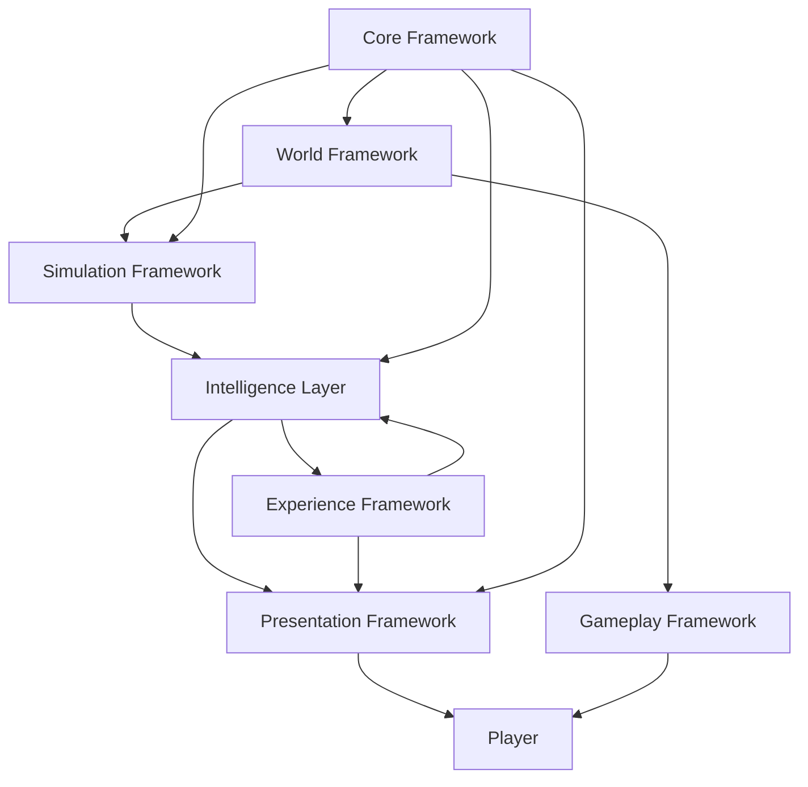
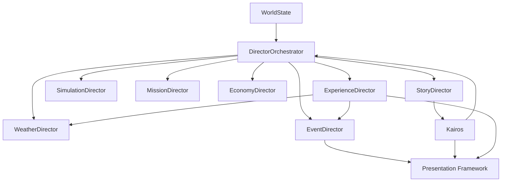
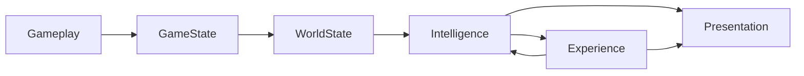
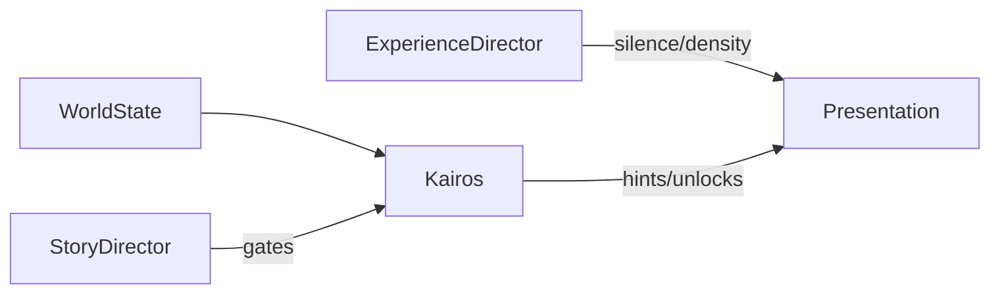

# Dark Matter Framework 2.0
## High-Level Architecture Specification
**Version 1.0 — Ratified Constitutional Authority**

**Status:** Ratified — Frozen  
**Ratified:** July 2026  
**Authority:** Highest-level technical document for Dark Matter  
**Subordinate docs:** Technical Design Bible, Engineering Standard, feature roadmaps, GDD 5.0 (game content only)

---

> **The primary objective of Dark Matter is not to simulate systems—it is to create believable experiences through interacting systems. Every framework, service, and tool ultimately exists to help the player believe that the world continues to exist whether they are watching it or not. The player does not drive the world; they participate in it.**

---

## Document hierarchy

| Tier | Document | Answers |
|------|----------|---------|
| 0 | **This document (HLA v1.0)** | WHY frameworks exist, how they relate, long-term vision |
| 1 | Technical Design Bible | HOW each system works, classes, data flow, dependencies |
| 2 | Engineering Standard | Coding rules, folder layout, coupling law |
| 3 | Feature roadmaps | Phased delivery (Communications, Simulation, etc.) |
| 4 | GDD 5.0 | Dark Matter: Genesis game design (first consumer of Dark Matter) |

Every AI coding session should begin with the Engineering Standard and cite the relevant HLA section for architectural context.

---

## Versioning policy (constitutional freeze)

This document is **frozen** after ratification. No casual edits.

| Version | Meaning |
|---------|---------|
| **1.0** | Initial ratified constitution (this document) |
| **1.x** | Clarifications, non-breaking additions |
| **2.0** | Breaking architectural change |

- Filename: `Dark_Matter_Framework_2.0_High_Level_Architecture_v1.0.md`
- Revisions require a changelog section and explicit architectural review
- TDB and Engineering Standard must cite `HLA v1.0 §X.Y`

---

# 1. Vision

## 1.1 What Dark Matter is

Dark Matter is **not a game**. It is a **Living World Architecture** — a reusable Unity framework for building story-driven, simulation-driven exploration RPGs where authored narrative and emergent world life coexist.

**Dark Matter: Genesis** is the first product built on Dark Matter. Game-specific content (Io, Aether Credits, Neural Echoes, sulfur storms) lives in the **Game layer**. Dark Matter owns patterns, services, intelligence, experience, and presentation that could support future titles.

Dark Matter is also **The World Engine** — a **World Operating System (WoOS)**.
It is not "here is my game." It is "here is the operating system that runs my world."
**Dark Matter: Genesis** runs on this stack (Unity 6 + URP). The world runs
continuously. The player steps into it.

## 1.2 The WoOS stack

The canonical architecture stack — how players actually remember games:

```
World
  ↓
Simulation
  ↓
Intelligence
  ↓
Experience
  ↓
Presentation
  ↓
Player
```

People do not remember code. They remember how a game **made them feel**. This stack encodes that truth in architecture.

| Layer | Role |
|-------|------|
| **World** | The planet exists — biomes, weather, resources, POIs |
| **Simulation** | The world lives off-screen — colony, companions, incidents |
| **Intelligence** | The world thinks — directors, Kairos, decisions |
| **Experience** | The world feels — pacing, silence, tension, relief, wonder |
| **Presentation** | The world communicates — radio, UI, audio, visuals |
| **Player** | Participation, not control — the player enters a running world |

Most Unity projects are built **player-in → systems-out**. Dark Matter is built **world-in → player touched last**.

## 1.3 Framework goals

1. **Reuse without rewrite** — Second games replace catalogs and adapters, not pillars
2. **Living world** — Systems continue whether the player watches or not
3. **Believable experiences** — Interacting systems create belief, not just mechanics
4. **Read-model clarity** — GameState (momentary) and WorldState (evolutionary) are explicit snapshots
5. **Intelligence orchestration** — Directors and Kairos evaluate state and emit intents
6. **Experience design in architecture** — Pacing, silence, and player emotional estimation are first-class
7. **Offline-first, AI-optional** — Rule-based systems ship first; LLM providers are swappable
8. **Editor-first velocity** — Tooling is a competitive pillar
9. **Solo AAA feasibility** — One developer + AI agents maintain via documented boundaries

## 1.4 Design philosophy (decision filter)

| Principle | Meaning |
|-----------|---------|
| Systems before content | Framework contracts precede quest lines |
| Framework before feature | Every feature has a named framework owner |
| Data before code | ScriptableObjects and snapshots before logic |
| Composition over inheritance | Capabilities via components, services, data |
| Services over managers | New work uses interfaces; legacy bridged via adapters |
| Events over direct references | Cross-framework signals via events or snapshot diff |
| Simulation over scripting | Emergent situations over one-off scripts |
| Story through intelligence | Quests are outputs of Story Director, not the brain |
| Experience through measurement | Player emotional state estimated, pacing adjusted |
| Silence is design | Knowing when not to talk is Experience, not omission |
| Reusable before game-specific | Game adapters wrap framework |
| Editor-first development | Authoring tools reduce code churn |
| Offline-first | No cloud dependency for core loop |
| AI optional | Template/rule providers are default |
| Deterministic where possible | Seeds, replay, tests |

## 1.5 Long-term roadmap (3–5 years)

| Era | Focus |
|-----|-------|
| **Genesis (complete)** | Core gameplay, legacy Scripts, editor tooling |
| **Architecture 1.0 (now)** | HLA v1.0, TDB, GameState, Communications, WorldState, Director stubs |
| **Architecture 2.0** | Simulation, Generation, Experience runtime, Intelligence layer |
| **Product 1.0** | Dark Matter: Genesis content vertical slices |
| **Framework export** | Optional package boundary, second game pilot |

## 1.6 Solo AAA + AI-assisted development

Dark Matter is optimized for **one lead developer augmented by AI coding agents**.

- One framework = one `Features/` folder with identical internal layout
- Interfaces are the prompt surface
- Snapshots are the debug surface
- 150–300 line files
- Explicit bootstrap order
- No circular dependencies
- HLA sections are machine-readable responsibility contracts

Documentation, framework modules, and AI agents form a **development ecosystem**.

---

# 2. Framework Pillars

Each pillar: **Purpose → Responsibilities → Inputs → Outputs → Dependencies → Future Expansion**.

---

## 2.1 Core Framework

**Purpose:** Engine layer every framework depends on.

**Responsibilities:** Bootstrap, save/load, session phase, input abstraction, time, logging, platform profiles, pooling registry.

**Inputs:** Platform config, settings, scene events  
**Outputs:** `IGameSession`, save services, bootstrap events  
**Dependencies:** None (root)  
**Future expansion:** Mod hooks, analytics, optional cloud save

**Current state:** `Assets/_Project/Scripts/Core/`, `Scripts/Managers/`

---

## 2.2 Gameplay Framework

**Purpose:** Moment-to-moment player and entity interaction.

**Responsibilities:** Player, combat, inventory, crafting execution, building interaction, vehicles, world use/pickup.

**Inputs:** Input service, item/recipe/building definitions  
**Outputs:** Gameplay events, GameState domain snapshots  
**Dependencies:** Core, World, Presentation (HUD only)  
**Future expansion:** Tactical formations, destructible modules, console aim assist

**Current state:** `Scripts/{Player,Combat,Inventory,Crafting,Building,Vehicles,Interaction}/`

---

## 2.3 World Framework

**Purpose:** The planet as a place.

**Responsibilities:** Biomes, zones, resources, POIs, weather scheduling, map data, hazards, spawn tables, ancient structures.

**Inputs:** World seed, biome definitions, time, player position  
**Outputs:** Environment snapshots, discovery/hazard events  
**Dependencies:** Core, Generation  
**Future expansion:** Io biomes, streaming, procedural POI injection

**Current state:** `Scripts/Map/`, `Scripts/Survival/Exposure/`

---

## 2.4 Simulation Framework

**Purpose:** Off-screen and aggregate life. **Generates situations, not scripted quests.**

**Responsibilities:** Pioneer schedules, needs, jobs, relationships, morale, colony production, Echo population, research ticks, incident generation, simulation history.

**Inputs:** WorldState, GameState, simulation definitions, elapsed sim time  
**Outputs:** Simulation events → Intelligence layer; WorldState updates  
**Dependencies:** Core, WorldState, World  
**Future expansion:** Command Center room sim, injury/heal loop

**Current state:** Partial — roster, facilities, building queues

---

## 2.5 Story Framework

**Purpose:** Authored narrative data and persistence — chapters, quest templates, story flags, mission definitions.

**Responsibilities:** Story chapter graph, quest lifecycle data, mission objectives, faction flags, Resonance gates (data). **Execution** lives in Story Director (Intelligence layer).

**Inputs:** WorldState, player actions  
**Outputs:** Story state changes, WorldState story fields  
**Dependencies:** Core (persistence), WorldState  
**Future expansion:** Branching graphs, Story Timeline editor

**Current state:** `Scripts/Quests/QuestManager.cs` — legacy; future `Features/Story/`

---

## 2.6 Intelligence Layer

**Purpose:** The world **thinks**. Not a single framework folder — an architectural layer composing Directors and Kairos.

**Contains:**

```
StoryDirector
MissionDirector
SimulationDirector
EventDirector
WeatherDirector
EconomyDirector
ExperienceDirector
Kairos Framework
AIDirector (future, optional)
DirectorOrchestrator
```

**Responsibilities:** Evaluate WorldState (+ events), emit **intents** and **commands** through narrow interfaces. Never mutate foreign frameworks directly.

**Inputs:** WorldState, GameState, simulation/story events  
**Outputs:** Commands to gameplay adapters, experience intents, presentation intents (transmissions, UI alerts)  
**Dependencies:** WorldState, Core  
**Future expansion:** `Features/Directors/`, `Features/Kairos/`

**Note:** Kairos is **world intelligence**, not Story. Story Director sets chapter gates; Kairos holds knowledge, lore, cores, and advisory commentary.

---

## 2.7 Experience Framework

**Purpose:** Control how the game **feels** — pacing, tension, mystery, wonder, solitude, danger, relief, accomplishment. **Not Story. Not Simulation. Experience design.**

This is how people remember games.

**Responsibilities:**

| Domain | Role |
|--------|------|
| **Pacing** | Tension and relief cadence |
| **Silence scheduling** | When nothing speaks — intentional absence |
| **Communication density** | How often radio/UI talks |
| **Radio density** | Incoming/outgoing transmission frequency |
| **Ambient density** | World audio, companion chatter, environmental voice |
| **Cognitive load** | UI complexity, simultaneous pressures |
| **Wonder / vista scheduling** | Beauty, mystery, horizon moments |
| **Danger budget** | Spawn pressure, hazard intensity caps |
| **Player emotional estimation** | Inferred player state (not NPC emotions) |

**Player emotional estimation (examples):**

The Experience Director does not read the player's mind. It **estimates** from telemetry:

| Signal | Example inputs |
|--------|----------------|
| **Stress** | Combat duration, low ammo, night, storm, low health, no radio |
| **Curiosity** | Time since last discovery, map unexplored ratio |
| **Wonder** | Time since vista, biome novelty |
| **Confidence** | Recent wins, full vitals, successful crafts |
| **Isolation** | No comms, solo expedition, empty radio |
| **Urgency** | Active timers, failing power, storm incoming |
| **Fatigue** | Session length, repeated near-death |
| **Satisfaction** | Recent accomplishment, quest complete |
| **Flow** | Balanced challenge + capability |

Example:

```
40 min combat + low ammo + night + storm + no radio + low health
  → Estimated Stress ≈ 82%
  → ExperienceDirector: ENOUGH — cave shelter, sunrise window, vista, soft radio, music shift
```

**Silence is design:**

- Player radios — nobody answers
- Companion doesn't speak
- Storms drown transmission
- Kairos waits

That is Experience, not missing content.

**Inputs:** WorldState, GameState (vitals, combat proxies), session clock, Intelligence event history (rolling window), presentation telemetry (time since last transmission)

**Outputs:** Experience intents → WeatherDirector, EventDirector, SimulationDirector, Presentation (Communications/UI/Audio), World (spawn/vista)

**Dependencies:** WorldState, Intelligence layer (orchestration), Presentation (delivery only)

**Future expansion:** `Features/Experience/`, `ExperienceProfile` ScriptableObjects, Pacing Debugger editor tool

**Boundary:**

| Framework | Owns |
|-----------|------|
| Story | Authored canon, chapter gates |
| Simulation | Emergent facts (greenhouse failed) |
| Experience | Cadence, silence, density, estimated player feel |
| EventDirector | Which incident fires |
| ExperienceDirector | How intensely, when, and whether the world speaks |

---

## 2.8 Presentation Framework

**Purpose:** Everything the player **perceives** — the world's voice and face. Intelligence decides; Presentation delivers.

**Contains:**

```
Communications (radio, transmissions, context → subtitle)
UI Framework (HUD, journals, menus, prompts)
Audio Framework (music, SFX, radio DSP, mix)
```

**Responsibilities:** Queue and render transmissions, HUD layout, theme, music state, SFX, subtitles, interaction prompts. **Never owns lore, pacing logic, or simulation.**

**Inputs:** Presentation intents from Intelligence and Experience layers, snapshots for display  
**Outputs:** Player-visible feedback; user input commands → Gameplay/Core  
**Dependencies:** Core, GameState/WorldState (read-only display)  
**Future expansion:** Adaptive music from Experience estimated stress

**Current state:** `Scripts/UI/`, `Scripts/Audio/`; Communications Documentation only (no Runtime C# yet).

**Rule:** Communications is **not** Intelligence. It presents what Intelligence and Experience authorize.

---

## 2.9 Kairos Framework (Intelligence)

**Purpose:** The world's central **knowledge intelligence** — memory cores, lore, archive, codex, unlocks, hints, advisory commentary. Lives inside the Intelligence layer.

**Responsibilities:** Memory Core restoration, lore archive, codex, blueprint/knowledge unlocks, exploration hints, story commentary (advisory mode), knowledge database, future AI grounding.

**Inputs:** WorldState, Story Director gates, discovery events  
**Outputs:** Unlock events, hint intents → Presentation (Communications), WorldState Kairos fields  
**Dependencies:** Story data, WorldState, Presentation (delivery), Simulation (incident context — does not run sim)

**Not:** An NPC MonoBehaviour with dialogue glued on. Not Story. Not Presentation.

**Dark Matter: Genesis canon:** Dormant prologue → repair quest → awakening → trust-gated advisory radio.

**Current state:** Communications advisory flag; full Features module planned.

---

## 2.10 Generation Framework

**Purpose:** Procedural content pipelines — editor batch and runtime seeded generation.

**Responsibilities:**

| Submodule | Role |
|-----------|------|
| Generation Core | Pipeline orchestration, validation |
| Seed System | Deterministic seeds |
| Probability Engine | Weighted tables, cooldowns |
| Pioneer Generator | Traits, biography from templates |
| Mission Generator | Objective mixes |
| Relationship Generator | Initial relationship webs |
| Blueprint / Lore / Name Generators | Content variants |
| Radio Chatter Generator | Ambient lines from templates |
| Dynamic Event Generator | Incident templates |
| Discovery / Quest Template / World Seed Generators | World content |

**Inputs:** Seeds, generation profiles, WorldState constraints  
**Outputs:** ScriptableObjects (Editor) or runtime instances  
**Dependencies:** Core, World, Story templates  
**Future expansion:** Optional ML assist — never required offline

**Status:** Designed; not yet implemented as Features module.

---

## 2.11 Editor Framework

**Purpose:** Dark Matter's long-term competitive advantage — authoring, validation, migration, visualization.

**Responsibilities:** Pioneer Builder, Scenario Builder, Quest Builder, Memory Core Builder, Dialogue Builder, Relationship Viewer, Simulation Debugger, **Pacing Debugger**, Story Timeline, World Generator, Validation Tools, Migration Tools, Framework Visualizer, Dependency Viewer.

**Inputs:** Framework schemas, snapshots (play mode debug)  
**Outputs:** Validated ScriptableObjects, reports  
**Dependencies:** All frameworks (read-only inspection)

**Current state:** 100+ scripts under `Assets/_Project/Editor/`

---

## 2.12 Networking Framework (future)

**Purpose:** Optional multiplayer. Architecture awareness only today.

**Design constraint:** Snapshots serializable; no hidden mutable statics in new Features code.

---

## 2.13 AI Layer (optional)

**Purpose:** Swappable conversation/planning backends — never required for offline play.

**Responsibilities:** `IConversationProvider`, context pack consumption, snapshot-only grounding, fail-soft to templates.

**Dependencies:** Presentation (Communications), WorldState, Intelligence (AIDirector future)

**Current state:** Communications docs under `Features/Communications/`; Runtime Phases 0–8 **not on disk**. Phase 9+ LLM deferred.

---

# 3. Framework Relationships

## 3.1 WoOS layer stack



## 3.2 Intelligence layer internals



## 3.3 Data read path



---

# 4. Framework Boundaries

| Framework / Layer | Owns | Does NOT own |
|---------------------|------|--------------|
| **Core** | Bootstrap, save, session, input, time | Gameplay rules, narrative |
| **Gameplay** | Combat, inventory, craft, vehicles | Story progression, pacing |
| **World** | Biomes, POIs, weather schedule, map | Relationships, quest state |
| **Simulation** | Schedules, needs, jobs, incidents | Authored chapters, radio DSP |
| **Story (data)** | Quest/chapter definitions, flags | Runtime adjudication (Directors) |
| **Intelligence** | Director eval, Kairos knowledge, intents | Direct inventory mutation |
| **Experience** | Pacing, silence, density, player feel estimates | Quest canon, incident facts |
| **Presentation** | Radio queue, HUD, audio mix, UI | Lore authority, pacing logic |
| **Generation** | Procedural pipelines | Runtime quest adjudication |
| **Editor** | Authoring, validation | Runtime state ownership |
| **AI Layer** | Provider adapters | Snapshot construction |

**Violations to forbid:**

- Communications reading `InventorySystem` → use GameState
- Story Manager enqueuing radio → Intelligence → Presentation intent
- Simulation writing quest complete → emit event; Story Director decides
- Experience overriding Story chapter gates → modulates intensity only

---

# 5. Data Flow

## 5.1 Canonical pipeline

```
Player Input
    ↓
Gameplay Framework (momentary mutation)
    ↓
Legacy Managers (adapters — transition)
    ↓
GameStateService.GetSnapshot()      ← momentary truth
    ↓
WorldStateService.GetSnapshot()     ← evolutionary truth
    ↓
Intelligence Layer (Directors + Kairos → intents)
    ↓
Experience Framework (pacing, silence, emotional estimation → experience intents)
    ↓
Presentation Framework (Communications, UI, Audio)
    ↓
Player perception
    ↓
Core Save (checkpoints — not every snapshot)
```

## 5.2 Snapshot models

| Model | Question | Consumers |
|-------|----------|-----------|
| **GameStateSnapshot** | What is true right now? | HUD, ContextBuilder, Experience telemetry |
| **WorldStateSnapshot** | Where is the world in its evolution? | Intelligence, Experience, Kairos |
| **ExperienceSnapshot** | How has the session felt? (densities, estimates) | ExperienceDirector |
| **GameSaveData** | What persists across sessions? | Core save only |

## 5.3 Event vs snapshot vs command

- **Snapshots** — cross-framework read (AI-safe, testable)
- **Events** — something changed, re-evaluate
- **Commands / Intents** — Intelligence/Experience → write path via narrow interfaces

---

# 6. Service Architecture

## 6.1 Managers → Services (migration)

**Legacy:** MonoBehaviour singletons + `EnsureExists()` — untouched code OK.

**New Features:** Interface-first services, plain C# where possible, adapters in Assembly-CSharp, bootstrap registration.

## 6.2 Service registry

Lightweight Core-owned registry — not heavy DI.

```
CoreBootstrap
  Register(IGameStateService)
  Register(IWorldStateService)
  Register(ICommunicationsService)    → Presentation
  Register(IDirectorOrchestrator)     → Intelligence
  Register(IExperienceService)        → Experience (future)
```

## 6.3 Bootstrap order (locked)

```
1. PlatformGraphicsBootstrap
2. GameSession / settings
3. MainMenuController
4. SimpleGameManager.Awake
5. GameStateBootstrap
6. WorldStateBootstrap
7. CommunicationsBootstrap          (Presentation)
8. DirectorsBootstrap               (Intelligence)
9. ExperienceBootstrap              (future)
10. CompanionSystemsBootstrap tail  (legacy bridges)
11. UIManager / HUD                 (Presentation)
```

## 6.4 Migration (no big-bang)

1. Interface + snapshot in `Features/`
2. Adapter reads legacy manager
3. New consumers use interface only
4. Extract write logic behind command interface when touching legacy
5. Deprecate direct singleton access in docs

---

# 7. World State

WorldState = **evolution of the world itself**, not momentary vitals.

## 7.1 Domains

| Domain | Example fields |
|--------|----------------|
| Story Progress | chapter id, beat flags |
| Planet Evolution | exploration %, biome unlocks |
| Organization Influence | faction standing |
| Terraforming Progress | dome coverage (future) |
| Echo Population | rescued, integrated |
| Ancient Network Status | nodes discovered |
| Memory Core Restoration | found, restored, attached |
| Threat Level | global danger |
| Colony Stage | Founding → Established → … |
| Human Expansion | outposts, population |
| Planet Awareness | world reactivity scalar |
| Environment Crisis | sulfur storm phase |
| Kairos State | dormant → advisory → trusted |
| Experience Telemetry | time-since-relief, densities (feeds ExperienceSnapshot) |

## 7.2 Shape (conceptual)

```
WorldStateSnapshot
├── Game: GameStateSnapshot
├── Story: StoryProgressSnapshot
├── Planet: PlanetEvolutionSnapshot
├── Colony: ColonyEvolutionSnapshot
├── Kairos: KairosSnapshot
├── Simulation: SimulationSnapshot
├── Threat: ThreatSnapshot
├── Experience: ExperienceSnapshot
└── Meta: WorldStateMeta
```

## 7.3 Rules

- Immutable DTOs in `Features/WorldState/Runtime/`
- Providers in Adapters — may read legacy managers
- Intelligence and Experience **read only** via `IWorldStateService`
- Persistence maps into `GameSaveData` over time — not a second save file

---

# 8. Intelligence Layer — Directors

## 8.1 Director catalog

| Director | Responsibility |
|----------|----------------|
| **StoryDirector** | Authored beats, chapter gates, quest availability |
| **SimulationDirector** | Off-screen colony tick, needs, relationships |
| **MissionDirector** | Expedition objectives, trio constraints |
| **WeatherDirector** | Hazard scheduling, storm phases |
| **EconomyDirector** | AC milestones, trade gates |
| **ExperienceDirector** | Pacing, silence, densities, player emotional estimation |
| **EventDirector** | Dynamic incidents between beats |
| **AIDirector** (future) | Tactical suggestions — optional, last |
| **Kairos** | Knowledge, cores, lore, hints, unlocks (Intelligence, not Story) |

## 8.2 Evaluation order (locked)

```
StoryDirector
  → SimulationDirector
  → MissionDirector
  → WeatherDirector
  → EconomyDirector
  → ExperienceDirector
  → EventDirector
  → AIDirector (optional)
```

Kairos participates within Intelligence eval — consulted by Story and Experience; emits knowledge/hint intents to Presentation.

ExperienceDirector runs **before** EventDirector — shapes feel and silence before presentation.

## 8.3 Execution model

- Event-driven + low-frequency simulation tick
- Idempotent eval (snapshot hash)
- `DirectorOrchestrator` — single entry point
- Commands via narrow interfaces (`IQuestCommandService`, `ICommunicationsIntentService`, etc.)

---

# 9. Kairos Framework (Intelligence)

See §2.9. Key relationship shift in v1.0:

- **Was conceptualized as:** Story-adjacent narrative system
- **v1.0 position:** Intelligence layer — the world's knowledge brain
- **Presentation:** Communications delivers Kairos speech; Kairos does not own the radio stack



---

# 10. Generation Framework

See §2.10. Deterministic seeds. Editor and runtime modes. One `IGenerator<TIn,TOut>` interface per generator for AI-agent-friendly PRs.

---

# 11. Simulation Framework

See §2.4. Simulation produces **incidents** (structured data), not quests. EventDirector + ExperienceDirector + StoryDirector filter before Presentation.

**Emergence example:**

```
Main Story beat complete
  → player leaves colony
  → Simulation runs
  → storm damages greenhouse
  → medic injured
  → power shortage
  → player returns
  → Story continues
```

---

# 12. Editor Framework

See §2.11. Menu path: `Dark Matter: Genesis / Dark Matter / <Framework> / …`

**Pacing Debugger** (Experience): session stress estimate, density meters, silence timeline — play-mode read of ExperienceSnapshot.

---

# 13. Migration Strategy

1. **No mass file moves**
2. **All new cross-cutting work** → `Features/<Name>/`
3. **Legacy touched** → adapter, not rewrite in same PR
4. **Compile always green**
5. **Document mapping** in TDB `Framework_Folder_Mapping.md`

**Priority order:** WorldState → Directors → Story adapters → Simulation → Kairos → Generation → Experience → Gameplay splits when needed.

---

# 14. Technical Principles

1. One responsibility per service (150–300 lines)
2. One direction of dependencies — no cycles
3. Composition over inheritance
4. Interfaces everywhere (cross-framework surface)
5. Minimal singletons in new code
6. Data-driven (ScriptableObject-first)
7. Offline-first; AI optional
8. Editor-first
9. Future multiplayer awareness (serializable snapshots)
10. Deterministic where possible
11. Fail soft for content; fail hard for broken bootstrap contracts
12. Prefix logs `[FeatureName]`
13. GDD = game truth; HLA = engineering truth

## AI agent session checklist

1. Which framework pillar owns this work?
2. Which boundary must not be crossed?
3. Read path: GameState, WorldState, or ExperienceSnapshot?
4. Write path: command interface or adapter?
5. WoOS layer: World / Simulation / Intelligence / Experience / Presentation?
6. Design Pillars: which does this strengthen?
7. Bootstrap slot?
8. Test: EditMode or F-key smoke?

---

# 15. Design Pillars

Dark Matter exists to create **believable worlds through systems**.

Every feature — framework module, game system, editor tool, or content pipeline — must support **one or more** of these pillars:

| Pillar | Meaning |
|--------|---------|
| **Exploration** | Moving through space reveals the world |
| **Discovery** | Finding secrets, lore, resources, POIs |
| **Survival** | Pressure, resources, environment, consequence of neglect |
| **Colony** | Base life, companions, jobs, growth, interdependence |
| **Memory** | Past preserved — Echoes, cores, archive, history |
| **Consequence** | Actions persist and change future options |
| **Mystery** | Unanswered questions pull the player forward |
| **Replayability** | Seeds, emergence, variation without sameness |
| **Emergence** | Simulation creates unscripted situations |
| **Meaningful Agency** | Choices with consequences — not button clicks |
| **Believability** | Systems behave consistently so the world feels like it exists beyond the player's presence |

**Believability** is the north star: not realism — **consistency**. Weather, companions, creatures, Kairos, Echoes, android patrols may be simplified, but they must behave coherently enough that the player believes the world continues when they look away.

**Feature gate rule:**

> If a proposed feature strengthens **none** of these pillars, it should be **reconsidered or removed**.

**Experience Framework** primarily serves: Mystery, Exploration, Discovery, Believability, Emergence, Meaningful Agency — through pacing, silence, and feel.

---

# Appendix A — Current implementation map (July 2026; disk-corrected July 22)

| HLA pillar / layer | Status (disk) | Location |
|--------------------|---------------|----------|
| Core | Shipped (legacy) | `Scripts/Core/`, `Scripts/Managers/` |
| Gameplay | Shipped (legacy) | `Scripts/{Player,Combat,...}/` |
| World | Partial | `Scripts/Map/`, `Scripts/Survival/Exposure/` |
| Simulation | Partial | Roster, facilities, queues |
| Intelligence | Designed — not on disk | Planned `Features/Directors/` |
| Experience | Designed — not on disk | Planned `Features/Experience/` |
| Presentation | Partial | `Scripts/UI/`, `Scripts/Audio/`; Communications **docs only** |
| GameState API | Designed — not on disk | Planned `Features/GameState/` |
| WorldState | Designed — not on disk | Planned `Features/WorldState/` |
| Kairos | Planned | Flag / story — no Features module yet |
| Generation | Partial | Legacy `EchoGenerator` only; `Features/Generation/` not started |
| Editor | Strong | `Assets/_Project/Editor/` |

Progress truth: [World_Engine_Disk_Status.md](World_Engine_Disk_Status.md) · GDD 5.0 Appendix B.

---

# Appendix B — Ratification record

| Field | Value |
|-------|-------|
| Version | 1.0 |
| Status | Ratified — Frozen |
| Ratified | July 2026 |
| Next document | Dark Matter Technical Design Bible (implements HLA v1.0) |

**Changelog:**

- **v1.0** — Initial ratification. Living World Architecture. WoOS stack: World → Simulation → Intelligence → Experience → Presentation → Player. Experience Framework with silence, density, player emotional estimation. Kairos positioned in Intelligence layer. Presentation layer (Communications + UI + Audio). Design Pillars including Believability and Meaningful Agency.
- **Appendix A disk correction (July 22, 2026)** — Implementation map updated: GameState / Directors / Communications Runtime marked designed-not-on-disk. HLA body remains frozen; see World_Engine_Disk_Status.md.

---

*End of Dark Matter Framework 2.0 — High-Level Architecture v1.0*
