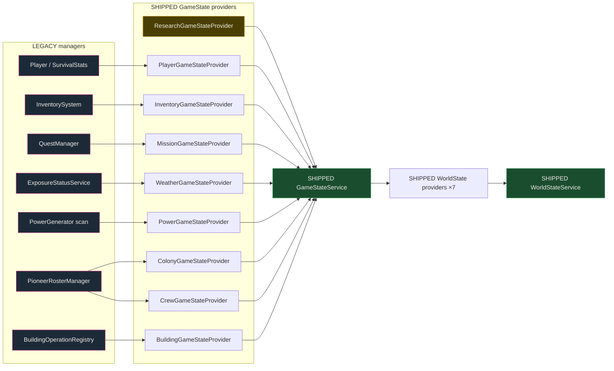
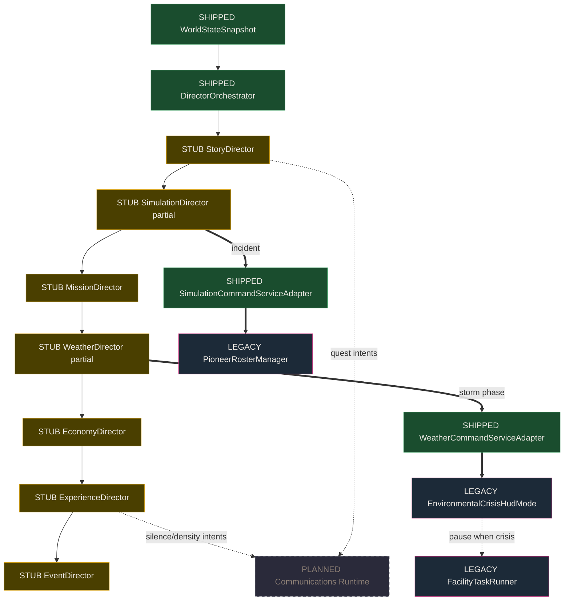

# World Engine — Reasoning Map

**Status:** Phase 0 + Phase 1 (M3 Read Path, M4 Intelligence Loop)  
**Branch baseline:** `cursor/consolidate-all-6666` (Run 1 spine + companion classes + identity lock)  
**Disk truth overlay:** [World_Engine_Disk_Status.md](World_Engine_Disk_Status.md)  
**Constitutional authority:** [Dark_Matter_Framework_2.0_High_Level_Architecture_v1.0.md](Dark_Matter_Framework_2.0_High_Level_Architecture_v1.0.md) (HLA v1.0 §3, §5, §8)

---

## Purpose

This document is the **reasoning map** for the World Engine — how the world **knows** (read models), **thinks** (directors), and **acts** (command adapters). Use it before adding features, wiring providers, or claiming a system is shipped.

**Invariant:** Directors never read legacy singletons directly. They read `WorldStateSnapshot` only.

---

## Phase 0 — Legend & status overlay

### Node status (apply to every map)

| Tag | Meaning | Visual in diagrams |
|-----|---------|-------------------|
| **SHIPPED** | `.cs` / `.asmdef` on disk under `Features/` or wired legacy bridge | Solid green-styled node |
| **STUB** | Type exists; heuristic or log-only behavior | Gold-styled node |
| **PLANNED** | Design ratified; no Runtime module yet | Dashed gray node |
| **LEGACY** | Pre-Features gameplay code; read/write via adapters only | Magenta border |

### Arrow types

| Arrow | Meaning |
|-------|---------|
| Solid `→` | Read / observe / snapshot contribution |
| Bold `⇒` | Command / write / side effect |
| Dotted `⋯→` | Planned path (Run 2+) |

### Maintenance rule

If a node is not listed here **and** not in `World_Engine_Disk_Status.md`, treat it as **not architecturally real** for agent sessions.

### Source documents (Phase 0 inventory)

| Priority | Document | Use |
|----------|----------|-----|
| 1 | HLA v1.0 §3.1–3.3 | WoOS stack, intelligence internals, read path |
| 2 | [Dark_Matter_Technical_Design_Bible.md](Dark_Matter_Technical_Design_Bible.md) | Contracts, provider tables |
| 3 | [World_Engine_Disk_Status.md](World_Engine_Disk_Status.md) | Shipped vs planned on disk |
| 4 | [Framework_Folder_Mapping.md](Framework_Folder_Mapping.md) | Layer → folder |
| 5 | GDD 5.0 Appendix B4–B5 | Roadmap runs 1–4 |

### Planned map suite (later phases)

| Map | Status |
|-----|--------|
| **M3 — Read path** | **This document (Phase 1)** |
| **M4 — Intelligence loop** | **This document (Phase 1)** |
| M1 — WoOS spine | Phase 2 |
| M2 — Bootstrap lifecycle | Phase 2 |
| M5 — Domain management | Phase 2 |

Diagram sources: [diagrams/M3_read_path.mmd](diagrams/M3_read_path.mmd), [diagrams/M4_intelligence_loop.mmd](diagrams/M4_intelligence_loop.mmd)

---

## M3 — Read path (reasoning input)

**Question answered:** *What does the brain know before it decides?*

### Canonical pipeline

```
Legacy gameplay mutation
    → IGameStateProvider (×9)
    → GameStateService.GetSnapshot()     ← momentary truth
    → IWorldStateProvider (×7)
    → WorldStateService.GetSnapshot()    ← evolutionary truth (+ embedded GameState)
    → DirectorOrchestrator.Evaluate()
```

Bootstrap entry: `CompanionSystemsBootstrap` → `GameStateBootstrap` → `WorldStateBootstrap` → `DirectorsBootstrap`  
Locked order constant: `DarkMatterBootstrapOrder.CompanionSystems`

### M3 diagram



### GameState providers (9)

| Provider | Status | Legacy source | Snapshot domain / fields |
|----------|--------|---------------|---------------------------|
| `PlayerGameStateProvider` | SHIPPED | `PlayerLocator`, `SurvivalStats` | Health, energy, stamina, O₂, thermal, radiation, sulfur, volcano, position |
| `InventoryGameStateProvider` | SHIPPED | `InventorySystem` | Slot counts, equipped items |
| `MissionGameStateProvider` | SHIPPED | `QuestManager` | Active / completed quest counts |
| `WeatherGameStateProvider` | SHIPPED | `ExposureStatusService`, `EnvironmentalCrisisHudMode` | Thermal label, hazard levels, shelter, crisis flag, active zones |
| `PowerGameStateProvider` | SHIPPED | `PowerGenerator` scene scan | Generator count, total output |
| `ColonyGameStateProvider` | SHIPPED | `PioneerRosterManager` | AC, workers, skilled count, injuries, shelter, expedition trio |
| `ResearchGameStateProvider` | **STUB** | *(none)* | Always `ResearchSnapshot.Empty` |
| `CrewGameStateProvider` | SHIPPED | `PioneerRosterManager.SkilledPioneers` | Expedition crew roster slice |
| `BuildingGameStateProvider` | SHIPPED | `BuildingOperationRegistry` | Building count, assigned pioneers, queued jobs |

**Bootstrap:** `Features/GameState/Adapters/GameStateBootstrap.cs`

### WorldState providers (7)

| Provider | Status | Reads | Snapshot domain / fields |
|----------|--------|-------|---------------------------|
| `StoryWorldStateProvider` | SHIPPED | `QuestManager` | Chapter id, active/completed quest counts, primary quest id |
| `ColonyEvolutionWorldStateProvider` | SHIPPED | `PioneerRosterManager` | Total companions, workers, injuries, shelter, echo chronicle count, AC |
| `KairosWorldStateProvider` | **STUB** | Static flag only | `AdvisoryUnlocked`, awake, memory cores attached (0) |
| `EnvironmentWorldStateProvider` | SHIPPED | `ExposureStatusService`, `WeatherCommandServiceAdapter`, crisis HUD | Threat level, sulfur storm active, storm phase label, planet stub (seed=0) |
| `SessionWorldStateProvider` | SHIPPED | `GameSession` | Session phase |
| `ExperienceWorldStateProvider` | **STUB** | Crisis HUD heuristic | Radio density, tension, prefer-silence (crisis-driven guess) |
| `SimulationWorldStateProvider` | SHIPPED | `PioneerRosterManager.EchoChronicle` | Incident count, last incident id, tick index (0) |

**Bootstrap:** `Features/WorldState/Adapters/WorldStateBootstrap.cs`  
**Embeds:** full `GameStateSnapshot` on every `WorldStateSnapshot` build.

### Read-path gaps (reasoning notes)

| Gap | Impact |
|-----|--------|
| `ResearchGameStateProvider` empty | Directors cannot reason about lab progress |
| `PlanetEvolutionSnapshot` stubbed | No seed / exploration % in world brain |
| `SimulationSnapshot.TickIndex` always 0 | No simulation clock in read model |
| Map / biome systems not in providers | World layer invisible to directors |
| No live `EvaluateAll()` on `SimulationTick` | Brain only runs on manual/smoke triggers today |

---

## M4 — Intelligence loop (reasoning brain)

**Question answered:** *How does the world think and what does it change?*

### Locked director eval order (HLA §8.2)

```
Story → Simulation → Mission → Weather → Economy → Experience → Event
```

**Orchestrator:** `Features/Directors/Runtime/DirectorOrchestrator.cs`  
**Bootstrap:** `Features/Directors/Adapters/DirectorsBootstrap.cs` — replaces Weather + Simulation stubs with command-wired services.

### M4 diagram



### Directors table

| Director | Status | Wired commands | Current behavior |
|----------|--------|----------------|------------------|
| Story | STUB | `IQuestCommandService` (unused) | `StubDirector` — no-op |
| Simulation | STUB partial | `SimulationCommandServiceAdapter` | Logs on `SimulationTick` / `ManualDebug`; can append echo chronicle incidents |
| Mission | STUB | — | `StubDirector` — no-op |
| Weather | STUB partial | `WeatherCommandServiceAdapter` | Logs on `StormPhaseChanged` / `ManualDebug`; F11 cycles phases via adapter |
| Economy | STUB | — | `StubDirector` — no-op |
| Experience | STUB | — | Logs density/silence on `ManualDebug` only |
| Event | STUB | — | `StubDirector` — no-op |

### Command adapters (write path)

| Adapter | Status | Writes to | Effect |
|---------|--------|-----------|--------|
| `WeatherCommandServiceAdapter` | SHIPPED | `EnvironmentalCrisisHudMode.SetCrisisActive` | Storm phase → crisis banner + HUD overlay; exposes `CurrentPhaseStatic` back to `EnvironmentWorldStateProvider` |
| `SimulationCommandServiceAdapter` | SHIPPED | `PioneerRosterManager.AppendEchoChronicle` | Records simulation incidents in echo chronicle |

**Coupling law:** Presentation (`EnvironmentalCrisisHudMode`) is written by Intelligence command adapters, not by quest scripts or building UI.

### Known management loop (weather → production)

```
F11 smoke / WeatherCommandServiceAdapter.SetStormPhase
    ⇒ EnvironmentalCrisisHudMode (crisis active)
    ⇒ FacilityTaskRunner pauses BuildingOperationRegistry.TickAllFacilities
```

Files: `FacilityTaskRunner.cs` (reads `EnvironmentalCrisisHudMode.IsCrisisActive`), `BuildingOperationRegistry.cs`

### Director triggers

| Trigger | Enum value | Fired today? | Typical consumer |
|---------|------------|--------------|------------------|
| `SessionStarted` | 0 | No scheduler | Story, Experience |
| `QuestCompleted` | 1 | No scheduler | Story, Mission |
| `RosterChanged` | 2 | No scheduler | Simulation, Economy |
| `SimulationTick` | 3 | **No auto tick** | Simulation, Economy, Event |
| `StormPhaseChanged` | 4 | F11 smoke only | Weather, Experience |
| `MemoryCoreRestored` | 5 | No scheduler | Story, Kairos (future) |
| `ManualDebug` | 6 | **F10 smoke** | All directors (log) |

**Smoke driver:** `Features/Directors/Adapters/DarkMatterSmokeDriver.cs`  
- **F9** — log `WorldStateSnapshot` one-liner  
- **F10** — `Evaluate(ManualDebug)`  
- **F11** — cycle storm phase + `Evaluate(StormPhaseChanged)`

### Intelligence gaps (reasoning notes)

| Gap | Run target |
|-----|------------|
| No `SimulationTick` scheduler calling `EvaluateAll()` | Run 4 living-world slice |
| 5/7 directors are `StubDirector` | Runs 2–4 per domain |
| No `Features/Communications/` Runtime | Run 2 — Presentation intents |
| No `Features/Experience/` module | Run 2+ — telemetry replaces heuristic provider |
| No `Features/Kairos/` Intelligence service | Future story arc |
| HLA §6.3 target order: Communications before Directors | Run 2 bootstrap reorder |
| `IQuestCommandService` unused | Story director ownership migration |

---

## Reasoning principles (callouts)

1. **Read models are truth** — `GameStateSnapshot` (momentary), `WorldStateSnapshot` (evolutionary).
2. **Intelligence proposes; commands commit** — directors evaluate → adapters write legacy.
3. **Presentation never owns pacing logic** — radio/HUD consume intents (Communications Run 2).
4. **Experience modulates intensity, not canon** — tension/silence only.
5. **Silence is a first-class output** — “no radio” is an Experience decision.
6. **Player participates; world runs** — player mutates gameplay → snapshots → directors → presentation.

---

## Changelog

| Date | Change |
|------|--------|
| July 23, 2026 | Phase 0 legend + Phase 1 M3/M4 maps, provider tables, stub/shipped overlay on `cursor/consolidate-all-6666` |
