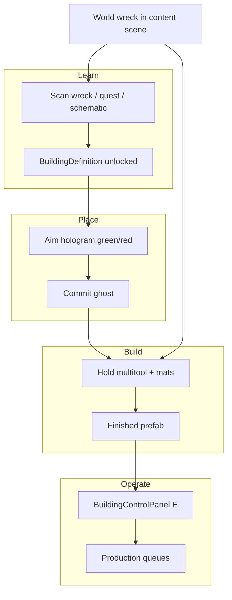

# Dark Matter: Genesis — Building System Scope Plan (Merged + Expanded)

**Status:** Scope lock for implementation  
**Merged from:** GDD 5.0 Appendix A7/A6, `GAME_BREAKDOWN.txt`, prologue/act bibles, asset-mapped plans, `Audit_05_Colony.md`, `World_Engine_Disk_Status.md`, desktop `DMG-building-system-plan.md` (2026-08-27)  
**Last updated:** 2026-09-24 (component library, material tiers, build hotbar, Building Studio)  

This document is the **single implementation scope** for building. Where the desktop plan and GDD disagree on *feel*, the desktop plan wins for placement/materialization UX. Where GDD locks economy, BCP tabs, storms, colony sim, and story beats, GDD wins. The 2026-09-24 component track is **additive**: wreck scans still unlock blueprints; map finds, crafted pieces, kits, and the Stone snap library sit on the same placement pipeline.

---

## 0. Executive summary

**Player fantasy:** Death Stranding construction + NMS/Subnautica hologram validity + Dune Awakening modular sets — learn blueprints by scanning wrecks and vital machines **or** by finding them on the map, spend gathered resources (stone first) to materialize snapped components and complete-structure kits, operate major structures through Building Control Panels while Colony Ops (then Kairos) drives the Memory Core hunt.

**Story spine:** Kade crashes on Io (Act 0) → claims Camp Plateau and bootstraps a real colony (Act I) → earns field certification and wakes **Aether-9 / Kairos** (Act II) → accepts the **10 Memory Core** mandate (Act II end) → each core triggers **Resonance Events** that stress and grow the base (Act III+).

**Engineering spine:** Structure slices 1–7 (definition → hold-construct → wrecks → authoring → save → BCP depth → campaign facilities), then the component track (Stone library → snap grid → build hotbar → Building Studio → map blueprints → tier upgrades). Reuse multitool, BCP, scanner, reverse dissolve, inventory resources, and World Engine `BuildingSnapshot`.

**Gap today:** BCP shell + queue registry exist; **no** `BuildingDefinition`, ghost/wreck pipeline, component library, build hotbar, Building Studio, or prologue placement quests on disk.

---

## 1. Fantasy & pillars

| Pillar | Description |
|--------|-------------|
| **Feel** | Death Stranding construction + No Man’s Sky / Subnautica hologram validity + Dune Awakening piece sets |
| **Not** | Fallout 4 junk-scrap welding; off-grid freeform glue; NavMesh-driven placement |
| **Learn loop** | Scan a wreck or vital machine, **or** pick up a blueprint in the world. Either unlocks a component, a kit, a building, or a machine. Repair in place or place a new copy later |
| **Craft loop** | Pick up stone and later ores. Spend them to materialize unlocked components, bases, and complete-structure kits |
| **Snap** | Snap to a 1 m grid and to neighboring component sockets. Base module is **4×4 m** |
| **Materialize** | Hold-construct: silhouette undissolves into finished prefab (`EnemyDisintegrate` reversed) |
| **Operate** | Finished major structures and vital machines use **Building Control Panels** (GDD lock). Loose components do not each open a BCP |
| **Story** | Buildings are narrative proof of foothold (Act I), competence (Act II), and campaign growth (Act III Resonance) |
| **Economy** | Resources + AC where GDD applies; Journal Craft = library only |

**Validity hologram:** the aim ghost is **green** when the player has the components for that part or building and the seat is valid. **Red** is the ghost after it is placed. A seat that is blocked, or a part the player cannot pay for, is not green and cannot be committed.  
**Resources:** drain **during hold**, not on ghost commit (cancel refunds drained ticks).

---

## 2. Main story — how building serves the campaign

### Story overview (Acts 0 → III)

| Act | Name | Player fantasy | Building role |
|-----|------|----------------|---------------|
| **0** | Charter | Who is Kade before Io? | None — UI only |
| **I** | Landing & Camp | We survived; we have a foothold | **First camp:** CC Seed → Shelter → Crafting Station; learn BCP |
| **II** | Cert & Machine | We earned deep tools; we woke something | Camp must **still stand** at prologue end; relay/caldera are story POIs not player-placed |
| **III+** | Ten Memories | Hunt cores; Io pushes back | Resonance Events **injure base-22, pause queues, unlock new facilities** |

**Locked lore rules (building-adjacent):**
- Pre-prologue: no Aether-9 name; dormant shell = liaison/probe/ledger contact only.
- Act I: Helix Meridian survey paint = **rumor**, not exposition.
- Act II end: Kairos names **ten** Memory Cores; trust = **Angry**.
- Act III: each core attach → 10–15 min Resonance Event (storms, base injury, Echo spawns).

### Act 0 — Charter (no building)

- Kade background, free starter companion, 0 AC, shuttle cinematic → Landing Scar.
- **Building scope:** none. Establishes companion who later appears on BCP Companions tab.

### Act I — Landing & Camp (building is the act climax)

| Scene | Quest (FUTURE) | Building beat | Implementation |
|-------|----------------|---------------|----------------|
| **A — Landing Scar** | `prologue_01_touchdown` | None | Movement, scan stake, moths |
| **B — Resource Ring** | `prologue_02_scavenge` | Fabricator ruin (Helix rumor); grant **Camp Beacon Kit** | Wreck scan could unlock CC Seed def (Slice 3) |
| **C — Claim Plateau** | `prologue_03_claim_site` | Clear nest → **place CC Seed** on snap pad → Emergency Cell power → **BCP Overview** | Slices 1–2; pad snap validity |
| **D — Bootstrap** | `prologue_04_bootstrap` | **Shelter** + **Crafting Station** → assign companion → **mini sulfur gust** (queue pause) | Slices 2–6 partial |

**Act I exit criteria (story):**
- [ ] CC Seed powered
- [ ] Shelter + Crafting Station live
- [ ] Companion assigned on BCP
- [ ] Mini gust survived (EnvironmentalCrisisHudMode + queue pause preview)

**Player line at exit:** *“We have a real foothold on Io.”*

### Act II — Certification, Ridge & Aether-9 (camp must persist)

| Scene | Quest (FUTURE) | Building beat |
|-------|----------------|---------------|
| **E — Lv5 cert** | `prologue_05_field_cert` | Settlement recipes (framing, scrubber) gated behind cert — crafted at **existing station** |
| **F — Ridge** | `prologue_06_ridge` | Relay Pylon = **story device interact**, not Lite Building place (reuse puzzle grammar) |
| **G — Wake Aether-9** | `prologue_07_aether_repair` | **Aether-9 shell** = authored caldera POI; repair = quest slots, not multitool pipeline (v1) |
| **H — Echo + mandate** | `prologue_08` + `prologue_end_ten_cores` | Camp standing check; Journal **0/10 cores** tracker |

**Act II exit criteria (story + building):**
- [ ] Camp still standing (Seed + Shelter + Station from Act I)
- [ ] Lv5 + mining or harvesting cert
- [ ] Aether-9 awakened (Angry)
- [ ] First Echo rescued
- [ ] 10-core hunt accepted

**Building scope in Act II:** no new major placements required for mainline — proves **save/load** and **storm pause** on existing camp matter.

### Act III+ — Ten Memories (building grows under pressure)

**Loop per core:** Find → setpiece → attach to Kairos → **Resonance Event** → fragment + unlock.

| Resonance impact on building (GDD + Acts plan) | System hook |
|------------------------------------------------|-------------|
| Sulfur / supercell weather | `BuildingOperationRegistry` queue **pause** |
| Command Center damage | Building injury / heal loop (base-22 shelter in CC rooms — future) |
| New facility unlock | Quest reward → `BuildingDefinition` unlock or wreck scan in new biome |
| Echo spawn chance | `EchoGenerator` during event — not building, but same director slice |

**Post-prologue named buildings (GDD A7) — campaign unlock order (draft):**

| Building | Story gate | Role |
|----------|------------|------|
| Command Center (full) | After Core 1–2 Resonance | Upgrade from Seed; aggregate base-22 sim |
| Echo Reclamation Chamber | Core 2–3 aftermath | Echo holding / reclaim UX |
| Purification Hub | B1 sulfur pressure | O₂ / strain gameplay |
| Medical Facility | Core 3–4 + injured companion beat | Heals, inoculations |
| Science Labs | Core 4–5 | Research queues on BCP Production |
| Probe Uplink / Comms module | Trust ≥ Wary | Kairos advisory path |
| Geothermal Harvester / Stabilizer | B4 caldera band | Mining attachment module |
| Resonance Beacon | Late Act III | Core hunt navigation |

Each becomes a `BuildingDefinition` + optional **world wreck** in the target biome content scene (`Terrain_X_Y_Content`).

---

## 3. What we have in the game today (disk truth)

### Playable prototype core (GDD B1 — shipped)

| System | On disk | Building relevance |
|--------|---------|-------------------|
| Player / combat / survival | Invector bridge, `SurvivalStats`, exposure zones | Carry friction for Emergency Cell (quest layer) |
| Inventory + hotbar + craft | 24-slot inventory, `CraftingUI`, stations | Recipe language for `BuildingDefinition.recipe` |
| Journal hub | Quest, Map, Craft library, Companions, Skills | **Not** primary production UI (GDD lock) |
| Quests | `QuestManager` + 4 live quests (`GatherRocks`, etc.) | Prologue quests **not authored yet** |
| Economy | AC on save/HUD; starter companion pick | Lite Building costs resources + AC at vendors |
| Roster / trio | `PioneerRosterManager`, expedition UI | BCP Companions tab assigns base-22 |
| Echoes | `EchoGenerator`, world entities, rescue path | Parallel to building; chronicle hooks |
| Scanner / optics | `ScannableTarget`, `OpticsController`, scanner sweep | **Wreck → blueprint unlock** |
| Crisis HUD | `EnvironmentalCrisisHudMode` | Mini gust + storm queue pause preview |
| World Engine spine | `Features/GameState`, `WorldState`, `Directors`, `Validation` | `BuildingSnapshot` adapter exists |
| Gaia terrain | 4×4 tiles + 16 content scenes + impostors | Wrecks/dressing in `Terrain_X_Y_Content` |
| Active scene | `Dark Matter Genesis v1.6.2.unity` | Border fences in v1.6.x; systems scene |

### Building-specific (partial — GDD B2)

| Asset / script | Status | Notes |
|----------------|--------|-------|
| `BuildingControlPanel.cs` | **Shipped** | `IWorldUsable`, E prompt, craft station bind |
| `BuildingControlPanelUI.cs` (+ partials) | **Shipped** | Overview, Companions, Production, Craft, Changes, Health |
| `BuildingOperationRegistry.cs` | **Shipped** | Assignments (4 slots), demo queue, save snapshot |
| `FacilityTaskRunner.cs` | **Shipped** | Production tick bridge |
| `BuildingControlAssignmentHints.cs` | **Shipped** | Companion assign UX hints |
| `PowerGenerator.cs` / `PowerConsumer.cs` | **Shipped** | CC Seed power hook (Emergency Cell quest) |
| `PioneerClassTaskAffinity` / `BaseRoleCompanionBonusService` | **Shipped** | BCP role bonuses |
| `BuildingSnapshot` / `BuildingGameStateProvider` | **Shipped** | Save spine — extend for placed instances |
| `Shelter_Safe_Zone.prefab` | **Shipped** | Gust safe volume stand-in for Shelter |
| `Prefabs/Buildings/Command Center Variant.prefab` | **Shipped** | Art reference — not wired to placement pipeline |
| `Prefabs/Buildings/Science Lab Variant.prefab` | **Shipped** | Art reference |
| `ItemType.Multitool` | **Enum only** | No placement controller yet |
| `BuildingDefinition` / `BuildingGhost` / `BuildingWreck` | **Not started** | Core of this plan |
| Materialization / hold-construct | **Not started** | GDD B3 #7 |
| Prologue building quests | **Not started** | `prologue_01`–`prologue_08` FUTURE |
| Live `WeatherDirector` storm scheduler | **Partial** | Crisis HUD without full factory sim |
| Kairos shell + repair quest | **Not started** | Separate from multitool (authored POI) |

### Live quests vs story plan

| On disk today | Story plan (FUTURE) |
|---------------|---------------------|
| `GatherRocks`, `Get more Rocks`, `GuideSupplyRun`, `One_More` | `prologue_01_touchdown` … `prologue_end_ten_cores` |

Building implementation **does not block** on full prologue quest authoring — Slice 1 can prove on existing workbench/power prefab; prologue hooks land in Slice 3+.

### Communications / Kairos (context)

- **Colony Ops** is the radio voice through Act I–II until Kairos awakens.
- `Features/Communications` runtime **absent** (World Engine Run 2) — building queues and crisis copy can use stubs until rule-based comms lands.
- Kairos attach UI / trust ladder = Act II–III story, not Slice 1.

---

## 4. GDD alignment (non-negotiable)

### Lite Building → Full materialization path

GDD **Lite Building** is the camp-scale loop (Command Center anchor, shelters, utilities). This scope plan **is** the materialization pipeline GDD Appendix B lists as not started — implemented in slices below.

### Building Control Panels (Appendix A7 — locked UX)

- In-world terminal (**E**) → fullscreen overlay (**not** Journal)
- Tabs: **Overview | Companions | Production | Craft | Changes**
- Assign base-22 companions, production/craft queues, per-building settings
- Queues run on expedition; **pause during sulfur storms / Resonance Supercells**
- **Extend** existing UI — do not replace

### Attachment modules (post–Slice 5 / Act III band)

Generators, power grids, auto gather, logistics, communications, defense, mining — attach to cores; feed BCP Production / Changes tabs.

### Base-22 colony rules (Appendix A)

- Base companions impervious to most pressures; **sulfur storms** → Command Center rooms
- Building damage **injures, never kills** companions
- Resonance Events may spike storms and injure base-22 — hooks in Slice 6 + Act III directors

---

## 5. Two object kinds, one multitool



### A. World wreck (authored dressing)

- Lives in **`Terrain_X_Y_Content`** scenes — **not** gitignored Gaia terrain YAML
- **Act I example:** Portable Fabricator Ruin (Scene B) — scan teaches craft station or CC-related def
- **Act III example:** Ridge Archive android shell — scan teaches comms module wreck
- Walk up → **scan** → unlock `BuildingDefinition`
- Hold multitool + mats → **repair in place** (same construct path)
- **E on wreck:** scan/repair — **not** finished BCP

### B. New build (learned blueprint)

- Unlock via scan, map blueprint pickup, schematic, quest, or Resonance reward
- Equip nothing extra to open the bar. **Hold B** enters build mode; the building hotbar selects the unlocked piece, kit, or machine. Tap B stays binoculars.
- Hologram → ghost → hold → finished
- **Kits and vital machines** finish into a prefab with **Building Control Panel**
- **Components** finish into a snapped piece. They do not each open a BCP

### C. Component piece (Dune Awakening style)

- Same hologram, validity, hold-construct, and resource drain as a kit
- Footprint is a fixed meter size on the 1 m grid (section 18)
- Prefers **socket snap** to a neighboring piece; otherwise sits on the grid
- First playable set is **Stone**, blocked out with ProBuilder

---

## 6. Validity rules (NMS / Subnautica)

Green only if **all** pass:

| Check | Method |
|-------|--------|
| Ground contact | Gaia tile / Unity Terrain ray — **not** NavMesh |
| Slope | ≤ `BuildingDefinition.maxSlope` |
| Overlap | No other buildings, wrecks, blocking colliders |
| Playable bound | Inside v1.6 **construction / world border fences** |
| Story snap pads | Optional `BuildingSnapPad` volumes (CC Seed plateau — Act I-C) |
| Keep-clear | Optional later (hover paths) — **not v1** |

**No NavMesh** for placement or buildings.

---

## 7. Data model

### `BuildingDefinition` (ScriptableObject) — **new**

| Field | Purpose |
|-------|---------|
| `id` | Stable save key — never rename after ship |
| `displayName` | BCP header + hotbar label |
| `kind` | `Component` · `Kit` · `VitalMachine` |
| `materialTier` | `Stone` · `Iron` · `Steel` · `Silicate` · `Amalgam` (components; kits may stay unset) |
| `section` | Foundation, Wall, Floor, Roof, Block, MiniBlock, DoorFrame, Door, Window, Stair, Ramp, Triangle, Slope, Kit, Machine |
| `footprintMeters` | World size in meters (4×4, 1×4, 2×4, 4×8, 8×8, triangle, slope) |
| `sockets` | Named snap points (bottom, top, edges, door) |
| `upgradeToId` | Next-tier definition, empty on Amalgam |
| `finishedPrefab` | Usable building or piece |
| `wreckPrefab` | Optional ruined visual (kits / machines) |
| `recipe` | Mats + counts — stone first, later ores and mixes |
| `footprint` | Box/capsule overlap shape derived from `footprintMeters` |
| `maxSlope` | Degrees |
| `unlock` | Scan / map blueprint / schematic / quest / skill rank / `requiredPlayerLevel` |
| `starterUnlocked` | True only for the Stone starter set (first basic kit, seven pieces) |
| `constructTime` | Hold duration (seconds) |
| `controlPanel` / `craftStation` | BCP mode + `CraftingStationType` (kits and vital machines) |
| `ghostMaterial` | Palette hologram instance |
| `storyAct` | Optional: `Prologue`, `Act3`, etc. — for authoring filters |
| `requiresSnapPad` | Optional: CC Seed pad on plateau |

### Runtime components

| Component | Role | Status |
|-----------|------|--------|
| `BuildingGhost` | Committed silhouette, progress | **New** |
| `BuildingWreck` | Scan target + in-place repair | **New** |
| `BuildingSnapSocket` | Piece-to-piece snap point | **New** |
| `BuildingBlueprintPickup` | Map item that unlocks a def id | **New** |
| `BuildingSnapPad` | Story placement volumes | **New** (thin) |
| `BuildingControlPanel` | E terminal | **Exists** |
| `BuildingOperationRegistry` | Queues / assignments | **Exists** |
| `PowerGenerator` / `PowerConsumer` | Power graph | **Exists** |

### Save payload (Slice 5)

Per player-placed instance: `definitionId`, world pose, ghost vs complete, construct progress, drained resources state. Extend `BuildingSnapshot` / `BuildingGameStateProvider`. Rehydrate on tile load — **never** write into Gaia terrain YAML.

---

## 8. Reuse map (do not reinvent)

| Piece | Location / notes |
|-------|------------------|
| Multitool item type | `ItemType.Multitool` in `ItemData.cs` |
| BCP interact + UI | `BuildingControlPanel`, `BuildingControlPanelUI` (+ partials) |
| Deploy UX pattern | Hovercraft / walker drill deploy |
| Scanner unlocks | `ScannableTarget` + optics flow |
| Construct VFX | `EnemyDisintegrate` / `EnemyDisintegrationEffect` — `_DissolveAmount` **1 → 0** |
| UI palette | `DarkMatterGenesisUiPalette` — hologram **not gold** |
| Playable fence | v1.6 border fences — placement tests against them |
| Crisis / storm pause | `EnvironmentalCrisisHudMode` + `BuildingOperationRegistry` |
| Editor menus | `DarkMatterGenesisEditorMenus` → `Tools/Dark Matter Genesis/Buildings/` |
| Build hotbar | UITK on `UITK_Hud` — `BuildingHotbar.uxml` + `DMUiToolkitBuildingHotbar` |
| Authoring hub | Genesis Studio category **Building** (Building Studio) |
| Piece blockout | ProBuilder primitives saved as prefabs under the library folders |
| World save | `BuildingSnapshot`, `GameSaveSystem` |
| Companion assign | `PioneerRosterManager` + BCP Companions tab |

---

## 9. Story ↔ building unlock matrix (implementation targets)

| ID | Display name | Story gate | Unlock method | Slice | Content scene |
|----|--------------|------------|---------------|-------|---------------|
| `cc_seed` | Command Center Seed | Act I-C | Camp Beacon Kit quest item → snap pad | 2–3 | Plateau content / v1.6 pad |
| `survival_shelter` | Survival Shelter | Act I-D | Quest `prologue_04` + blueprint from CC | 2 | Camp plateau |
| `craft_station_settlement` | Crafting Station | Act I-D | Quest step / schematic | 2 | Camp plateau |
| `module_o2_scrubber` | O₂ Scrubber mount | Act I-D | Craft + place (small footprint) | 4 | Camp rim |
| `relay_pylon_story` | Relay Pylon | Act II-F | **Story interact only** — not Lite Building v1 | — | Ridge content |
| `aether9_shell` | Aether-9 Machine | Act II-G | **Quest repair slots** — not multitool v1 | — | Caldera POI |
| `echo_reclamation` | Echo Reclamation Chamber | Act III Core 2–3 | Resonance unlock + wreck scan | 5–6 | B1 content |
| `purification_hub` | Purification Hub | Act III Core 3–4 | Resonance + B1 wreck | 6 | B1 content |
| `medical_facility` | Medical Facility | Act III Core 4+ | Quest + wreck | 6 | B2+ content |
| `science_labs` | Science Labs | Act III Core 5+ | Resonance reward | 6 | Use existing Science Lab Variant prefab |
| `command_center_full` | Command Center | Act III Core 1–2 upgrade | Upgrade path from Seed | 6 | Camp plateau |

**Prologue minimum ship set:** `cc_seed`, `survival_shelter`, `craft_station_settlement`, `module_o2_scrubber` (+ fabricator ruin as wreck teacher).

---

## 10. World vs save boundaries

| Content type | Where it lives |
|--------------|----------------|
| Authored wrecks, tile dressing | `Terrain_X_Y_Content.unity` (16 scenes on disk) |
| Gaia terrain tiles | Session terrain scenes — not player base truth |
| Construction fences | **Dark Matter Genesis v1.6.x** main scene |
| Player-placed ghosts + buildings | Save → `BuildingSnapshot` |
| Camp Plateau snap pad / survey paint | Content scene or v1.6 authored blockout |
| Aether-9 caldera shell | Authored POI — Act II-G |

---

## 11. Implementation slices (ordered — do not skip)

### Slice 1 — Definition + hologram + instant complete

**Story:** None required — tech proof.  
**Goal:** Prove placement pipeline.

- [ ] `BuildingDefinition` SO + registry by `id`
- [ ] Hold B → aim hologram (green/red). Tap B stays binoculars
- [ ] Validity: footprint, slope, overlap, v1.6 fence
- [ ] Click → **instant** finished prefab
- [ ] First target: existing **workbench** or `PowerGenerator` mesh in project

**Exit:** Place inside fence; E → BCP opens.

---

### Slice 2 — Hold-construct + reverse dissolve + resource drain

**Story gate:** Enables **Act I-C / I-D** prologue building.  
**Goal:** Materialize feel.

- [ ] Click commits **ghost**
- [ ] Hold: `_DissolveAmount` 1→0, recipe drains over `constructTime`
- [ ] Cancel → refund drained
- [ ] Complete → finished prefab + `BuildingControlPanel` enabled
- [ ] **`BuildingSnapPad`** for CC Seed plateau
- [ ] **`Item_CampBeaconKit`** → starts placement mode for `cc_seed`
- [ ] Hook **mini gust queue pause** on `BuildingOperationRegistry`

**Exit:** Act I-D shelter + station playable with hold-construct.

---

### Slice 3 — Wrecks that teach blueprints

**Story gate:** Act I-B fabricator ruin; Act III biome wrecks.  
**Goal:** Scan-learn-repair loop.

- [ ] `BuildingWreck` + scan → unlock definition
- [ ] Hold-repair in place (Slice 2 path)
- [ ] Place fabricator ruin in prologue content scene
- [ ] Emergency Cell carry = quest item friction (no new building code)

**Exit:** Ruin in content scene → scan → repair → BCP online.

---

### Slice 4 — Authoring window

**Story gate:** Content team can author Act III buildings without programmer per prefab.  
**Goal:** Scale to 10+ definitions.

- [ ] `Tools/Dark Matter Genesis/Buildings/Author Building`
- [ ] Stamp definition, hologram mat, wreck, BCP, recipe
- [ ] Migrate `Command Center Variant` / `Science Lab Variant` to defs

**Exit:** New bench authored in one editor pass.

---

### Slice 5 — Save / load placed instances

**Story gate:** Act II requires **camp still standing** after ridge/caldera.  
**Goal:** Persistent base.

- [ ] Extend `BuildingSnapshot` for ghosts + finished poses
- [ ] Rehydrate on tile/session load
- [ ] Prologue state machine can query “camp complete” flags

**Exit:** Save/load restores camp layout.

---

### Slice 6 — BCP production depth + Act III Resonance hooks

**Story gate:** Act I-D companion assign; Act III queue pause under Resonance.  
**Depends on:** Slices 1–5; World Engine directors (roadmap #4).

- [ ] Companions tab ↔ `PioneerRosterManager` (real assign, not demo)
- [ ] Production tab live queues (`FacilityTaskRunner`)
- [ ] Craft tab ↔ per-definition `craftStation`
- [ ] Changes tab stub → attachment modules
- [ ] Full sulfur + **Resonance Supercell** pause
- [ ] Building injury flags for base-22 (interface for future CC room sim)
- [ ] Quest hooks: `prologue_04` companion assign objective pulse

**Exit:** Assign companion; queue ticks; pauses in crisis test; Act I-D gust pass.

---

### Slice 7 — Post-prologue facility rollout (campaign)

**Story gate:** Act III cores 1–10.  
**Not prologue-blocking.**

- [ ] Author Act III `BuildingDefinition`s per unlock matrix (§9)
- [ ] Wrecks in B1–B7 content scenes
- [ ] `ResonanceEventDirector` → queue pause + damage flags
- [ ] Upgrade path CC Seed → full Command Center
- [ ] Attachment modules: generator, mining, comms (one module at a time)

---

### Component track — Stone snap library (after Slice 1, parallel with Slices 2–4)

Does not replace kits, wrecks, or BCP. Shares hologram, validity, hold-drain, and `BuildingDefinition`. Full rules are section 18.

**C1 — Stone blockout.** ProBuilder primitives in the library folders. First basic kit unlocked without a blueprint: foundation 4×4, wall 4×4, floor 4×4, slope 4×4, window wall 4×4, door frame 4×4, basic door.

**C2 — Snap.** 1 m grid, 90° yaw, socket snap to neighbors, same green/red commit rule. Sizes: 4×4 base, plus 1×4, 2×4, 4×8, 8×8, triangle, slope.

**C3 — Build hotbar.** UITK. Ten visible slots, side arrows, no scrollbar. Up-arrow on the left opens the material panel. Stone is the only live tier.

**C4 — Building Studio.** Genesis Studio **Building** category. Drag-drop prefabs into sections. Workflow to add the next material tier.

**C5 — Map blueprints + craft.** World pickups unlock components, kits, buildings, and vital machines. Gathered stone (then ores and mixes) pays the hold-drain.

**C6 — Tiers and skills.** In-place upgrade Stone → Iron → Steel → Silicate → Amalgam. Later tiers stay empty until a blueprint and the skill rank exist.

**Exit:** Inside the fence, hold B opens the Stone hotbar, a foundation snaps to the grid, a wall snaps to that foundation, cancel refunds stone, and Building Studio can drop another Stone prefab into Walls without a code change.

---

## 12. Prologue QA checklist (building)

Cross-ref `Prologue_Acts_Expanded.md` QA section:

**Act I building beats:**
- [ ] Nest clear blocks red hologram on pad
- [ ] CC Seed snap pad only accepts `cc_seed` def
- [ ] Emergency Cell insert powers seed (`PowerConsumer`)
- [ ] BCP Overview opens; other tabs gated until Scene D
- [ ] Shelter interior = safe during mini gust
- [ ] Companion assign on BCP completes quest objective
- [ ] Queues pause during gust; resume after

**Act II building beats:**
- [ ] Return from caldera — camp buildings still in save
- [ ] No accidental placement during ridge/caldera quests

---

## 13. Out of scope (v1 / prologue)

- Fallout junk-scrap welding and off-grid freeform glue (snapped modular pieces are **in** scope)
- NavMesh placement or pathing
- Moving border fences to content scenes
- Gold hologram look
- A scrollbar on the building hotbar
- A second HUD `UIDocument` for the build bar
- Full structural-collapse simulation (v1 snaps and requires a supporting socket; pieces do not chain-collapse)
- Iron / Steel / Silicate / Amalgam art beyond empty tier slots and the upgrade hook
- Multi-tile mega structures beyond the 8×8 piece
- Gaia User Data as base truth
- Aether-9 shell as multitool build (quest POI only)
- Relay Pylon as player-placed building (story interact)
- Full attachment module graph (Slice 7)
- Maintenance decay loop (design after Slice 5)
- Full Command Center 22-companion room sim (roadmap #5)

---

## 14. Acceptance tests (per slice)

| Slice | Playtest proof |
|-------|----------------|
| 1 | Multitool → green hologram → instant finish → E → BCP |
| 2 | Ghost → hold → dissolve → complete; cancel refunds; snap pad works |
| 3 | Content wreck → scan unlock → repair → BCP |
| 4 | Author Science Lab from variant prefab in editor |
| 5 | Save/load camp after Act I-D sequence |
| 6 | Companion assigned; gust pauses queue; Act I-D completable |
| 7 | Core 1 Resonance pauses camp; new wreck unlock in B1 |
| C1–C4 | Stone foundation + wall snap; hotbar scrolls by arrows; Studio accepts a dropped prefab |
| C5 | Map blueprint unlocks a door; stone in inventory drains on hold |
| C6 | Placed Stone piece upgrades one tier when Iron is unlocked |

---

## 15. Open decisions

| Question | Recommendation |
|----------|----------------|
| Cancel refund | Refund all drained ticks |
| Blueprint UI | Building hotbar (section 18), not a new fullscreen builder. Deploy-menu pattern only if the hotbar is blocked |
| BCP tab gating | Overview-only until Act I-D step 4.3 |
| First author mesh | Scene workbench or `PowerGenerator` |
| Fabricator ruin | Teaches `craft_station_settlement` or `cc_seed`? → **station** (Scene B craft teach) |
| Starter AC | GDD says 5000; story Act 0 says 0 — **follow story doc for prologue** when quests land |
| Kairos comms | Ops only until trust gate; building UI unchanged |
| Build hotbar vs inventory hotbar | Build bar shows **only in build mode**. Inventory hotbar stays the gameplay bar |
| Enter build mode | **Hold B** (keyboard). Tap B stays binoculars. Hold B again exits. Gamepad: hold Left Shoulder, tap stays binoculars |
| Starter Stone pieces | First basic kit is `starterUnlocked`: foundation, wall, floor, slope, window wall, and door frame (all 4×4) plus a basic door. Every other piece, kit, and machine needs a scan or a map blueprint |
| Kits on the hotbar | Up panel lists **Stone** and **known buildings**. A building click loads that building’s hotbar. Stone click returns to stone components |
| Piece collapse | Supporting socket required to place. Removing supports does not collapse the structure in v1 |

---

## 16. Related documents

| Doc | Use |
|-----|-----|
| `GAME_DESIGN_DOCUMENT_5.0.txt` | A6 Kairos/cores, A7 buildings, A2b weather, B3/B4 |
| `GAME_BREAKDOWN.txt` | §10 building + code pointers |
| `Prologue_Acts_Expanded.md` | Act beat depth + QA |
| `Prologue_Playthrough_And_Camp_Bootstrap_Plan.md` | POI catalog + timing |
| `Acts_0_to_3_Asset_Mapped_Plan.md` | CURRENT/FUTURE assets per act |
| `Stages_0_1_Playthrough_Quest_Stages.md` | Quest stage breakdown |
| `Audit_05_Colony.md` | Architecture risks |
| `World_Engine_Disk_Status.md` | What is actually shipped |
| Section 18 of this plan | Component sizes, tiers, hotbar, library folders, Building Studio |

---

## 17. Cross-act dependency graph (building)

```
Act 0 (no building)
  → Act I Slice 1–2: cc_seed, shelter, station on Camp Plateau
  → Act I C1–C4: Stone snap pieces + build hotbar + Building Studio
  → Act I Slice 3 + C5: fabricator wreck and map blueprint pickups
  → Act I Slice 5–6: save camp + gust pause + companion assign
  → Act II: camp persistence check only; Iron+ tiers if skill and blueprint say so
  → Act III Slice 7: Resonance + new defs/wrecks per core
  → Campaign: full GDD facility set + attachment modules + amalgam mixes
```

---

## 18. Component construction, materials, hotbar, Building Studio

Added 2026-09-24. This is the modular track. Kits, wreck scans, and Building Control Panels stay as specified above.

### 18.1 Three ways to learn a blueprint

| Source | Unlocks |
|--------|---------|
| **Scan** a wreck or a vital machine | That building, machine, or the component it teaches |
| **Find** a blueprint pickup on the map | One component, a building, a vital machine, or a **kit** (complete structure) |
| **Quest / Resonance** | Same registry flag as a scan or a find |

A locked entry is absent from the hotbar. `starterUnlocked` pieces are the exception. The first basic kit is known when build mode first opens: Stone foundation, wall, floor, slope, window wall, and door frame (all 4×4), plus a basic door that only seats in the frame.

Gathering resources does **not** unlock a blueprint. Stone, iron, and the later mixes only pay the recipe once the entry is already known.

### 18.2 What the player places

| Kind | Examples | After it finishes |
|------|----------|-------------------|
| **Component** | Foundation, wall, floor, roof, block, mini block, door frame, door, window, stair, ramp, triangle, slope | Snapped piece. No BCP |
| **Kit** | Command Center Seed, Survival Shelter, Crafting Station | Complete structure. BCP on the prefab |
| **Vital machine** | Power cell socket, O₂ scrubber, fabricator | Machine prefab. BCP when the design says the machine is operated |

Story POIs stay out of this list: Relay Pylon and the Aether-9 shell are quest interacts.

### 18.3 Snap style (Dune Awakening)

Reference for **feel**, not a meter-for-meter copy: repeating piece sets, sockets between pieces, material tiers, and upgrading a placed piece into the next set.

| Rule | v1 |
|------|----|
| Grid | 1 m. Yaw in 90° steps |
| Priority | Socket on a neighbor within snap range, otherwise the grid under the aim point |
| Base module | **4×4 m** (foundations, floors, standard walls, standard roofs) |
| Partial widths | **1×4 m**, **2×4 m** |
| Long / large | **4×8 m**, **8×8 m** |
| Shapes | Right **triangle** (half of a 4×4), **slope** / ramp (4×4 run, one story rise) |
| Support to commit | Foundation on ground. Floor on a foundation or another floor. Solid wall, window wall, and door frame on a foundation or floor edge. Roof on a wall top. Basic door only in a door-frame socket |
| Collapse | Not in v1. A piece stays if its support is later removed |
| Validity | Same green/red hologram as section 6, plus the support rule. Red cannot commit |
| Bounds | Inside the v1.6 construction fences. No NavMesh |

Wall height for a standard wall matches the module: 4 m tall and 4 m wide. Mini walls keep the 4 m height and narrow to 1 m or 2 m.

### 18.4 Material tiers, mixes, skills, upgrades

Live tier at the start of implementation: **Stone** only. The other tiers exist as data so Building Studio can add them without a second system.

| Tier | Paid with | Skill gate |
|------|-----------|------------|
| **Stone** | Gathered stone | None. First basic kit is known immediately |
| **Iron** | Iron plus a stone binder | Building rank 1 (artisan / building skill) |
| **Steel** | Iron plus fuel / carbon | Building rank 2, or the Level 5 field cert |
| **Silicate** | Silicate shards (Io glass) | Building rank 3 |
| **Amalgam** | A **mix** — steel + silicate, optional AC | Building rank 4, and both Steel and Silicate already unlocked |

Amalgam is not a single ore. Later mixes (other pairings) are new tiers or new recipes authored in Building Studio, not new code.

**In-place upgrade.** Aim the multitool at a finished piece whose `upgradeToId` is unlocked and whose skill gate passes. Hold pays the **difference** in resources and swaps the visual to the next tier prefab. Save stores the definition id actually placed, so a reload does not revert the tier.

Skill ranks may later reduce recipe cost or `constructTime`. No numbers in this plan.

### 18.5 Library folders (ProBuilder first)

Blockout meshes are ProBuilder primitives saved as prefabs. Final art replaces the mesh on the same prefab. Folders are the library Building Studio writes into:

```
Assets/_Project/Prefabs/Buildings/Library/
  Stone/
    Foundations/
    Walls/
    Floors/
    Roofs/
    Blocks/
    MiniBlocks/
    DoorFrames/
    Doors/
    Windows/
    Stairs/
    Ramps/
    Triangles/
    Slopes/
  Iron/          (empty until that tier is authored)
  Steel/
  Silicate/
  Amalgam/
  Kits/
  VitalMachines/
```

Each prefab gets one `BuildingDefinition` whose `kind`, `materialTier`, `section`, and `footprintMeters` match the folder. First basic kit (`starterUnlocked`):

| Id | Section | Size | Snap |
|----|---------|------|------|
| `stone_foundation_4x4` | Foundations | 4×4 m | Ground |
| `stone_wall_4x4` | Walls | 4 m wide × 4 m tall | Foundation or floor edge |
| `stone_floor_4x4` | Floors | 4×4 m | Foundation or adjacent floor |
| `stone_slope_4x4` | Slopes | 4×4 m run, one story | Same as a floor |
| `stone_wall_window_4x4` | Windows | 4 m wide × 4 m tall | Same sockets as the solid wall. Opening holds a glass pane |
| `stone_door_frame_4x4` | DoorFrames | 4 m wide × 4 m tall | Same sockets as the solid wall. Empty doorway with one door socket |
| `stone_door_basic` | Doors | Fills the frame opening | Door socket on `stone_door_frame_4x4` only. Cannot commit on open ground |

ProBuilder blockout: flat box, vertical slab, thin floor slab, wedge, wall slab with a window hole plus a transparent pane, wall slab with a doorway hole, and a door slab sized to that hole. Glass is a blockout material on the window piece, not a new resource tier. The window wall and the door frame still cost stone. Further Stone pieces (1×4, 2×4, 4×8, 8×8, triangle, roofs) stay locked until a blueprint unlocks them.

### 18.6 Building hotbar (player UI)

UI Toolkit only, on the existing gameplay HUD host (`UITK_Hud`). No second `UIDocument`. No uGUI. No scrollbar.

Shown only in **build mode**. **Hold B** enters it. **Hold B** again exits. Tap B stays the existing binoculars shortcut and does not enter or exit build mode. While build mode is on, binoculars stay suppressed so a short press of B does not open them. Gamepad uses the same split on Left Shoulder (tap binoculars, hold build mode).

Hold-to-materialize (fire / use on a ghost) is a different hold from the B key. B only toggles the mode.

Tilde hides the bar with the rest of the gameplay HUD. Hidden in C# when build mode is off so the UXML stays visible in UI Builder. Journal, pause, and other modal UI block the hold.

```
[ ↑ ]   [ ← ] [ s ][ s ][ s ][ s ][ s ][ s ][ s ][ s ][ s ][ s ] [ → ]
```

| Piece | Behavior |
|-------|----------|
| **Ten slots** | The visible window into the unlocked list for the current selection |
| **← and →** | Sit on the ends of the 10-slot holder. Each click shifts **one** slot. Disabled at either end of the list. Hold may repeat. **No scrollbar** |
| **↑** | Sits to the **left** of that holder. Opens a panel **upward** listing **Stone** and every **known building** |
| **Known building** | Click loads that building into the hotbar |
| **Stone** | Click returns the hotbar to the Stone component list |
| **Empty list** | Stone is always in the panel, so the component list is never missing. A building row appears only after that building is known |
| **Can't afford** | Slot stays visible, Slate tint, cannot commit |
| **Selected slot** | Rich Fuchsia. That definition is what the hologram places |

Palette: Dark Navy slots, Slate borders, Deep Magenta arrows, Warm Off-White labels, Rich Fuchsia selection. Gold is not a building-bar color.

Files: `Assets/UI Toolkit/Screens/BuildingHotbar.uxml`, styles on the screen USS plus `DarkMatterGenesis.uss`, runtime `DMUiToolkitBuildingHotbar` on the HUD document. Bind with `root.Q`. Do not hide the bar with USS `display: none`.

### 18.7 Building Studio (tools)

Authoring lives in **Genesis Studio** as a **Building** category, opened from `Tools/Dark Matter Genesis/Buildings/Building Studio`. It is an editor workflow, not a Play-mode slider profile. `playModeSave` stays off.

**Create a material.** Name, tier, folder under `Library/`. Stone is the only one seeded. The button is how Iron and the later tiers appear.

**Sections** (drop wells, per selected material):

Base foundations · Walls · Floors · Roofs · Blocks · Mini blocks · Door frames · Doors · Windows · Stairs · Ramps · Triangles · Slopes

Kits and Vital Machines are their own sections, not nested under Stone.

**Drag a prefab** onto a section. Studio writes or updates the `BuildingDefinition` (id, kind, tier, section, default footprint for that section, recipe stub, hologram material) and files the prefab into the matching library folder.

**Create primitive.** Per section, generates the ProBuilder mesh at that section's default size, saves the prefab, and registers it the same way as a drop.

Replaces the one-off "Author Building" window as the place new pieces are added. The old one-pass prefab→definition action can be a button inside this studio (Slice 4) so kit authoring and piece authoring stay one tool.

### 18.8 Save

Each placed piece stores the same payload as a kit instance: `definitionId` (the tier actually built), pose, ghost vs complete, construct progress, drained resources. A Stone wall upgraded to Iron saves the Iron id. Blueprint unlocks persist beside the recipe-unlock set (BUILD-042).

---

*Constraints:* No NavMesh · Palette hologram not gold · Fences in v1.6 · Wrecks in content scenes · Reuse multitool/BCP/scanner/dissolve · Drain on hold · Instant Slice 1 before hold Slice 2 · Component track starts after Slice 1 · Stone before other tiers · **Hold B** enters build mode, tap B stays binoculars · Build hotbar is UITK, ten slots, arrow scroll, no scrollbar · Story POIs (Aether-9, Relay) stay quest-driven until explicitly promoted to `BuildingDefinition`.
