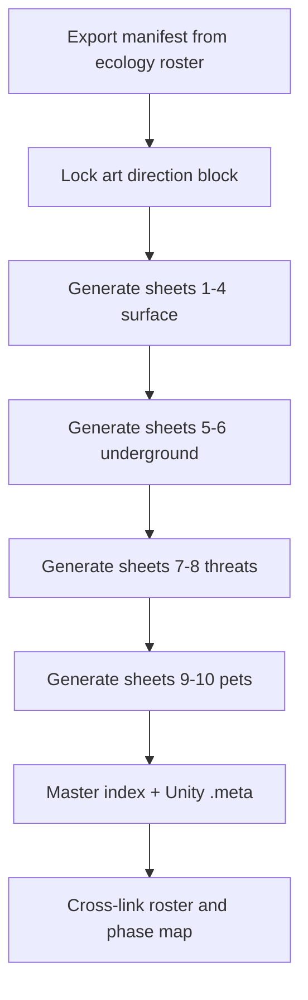

# Io Life Image Sheet — Plan

**Status:** Complete — two parallel sets (PBR concept + Ray Traced Ultra)  
**Art style lock:**  
- **Set A:** High-poly PBR concept contact sheets → `ArtReference/LifeSheets/`  
- **Set B:** Photoreal Unity 6 High/Ultra + hardware ray tracing look (not Unreal) → `ArtReference/LifeSheets_RayTraced/` (`RT_` prefix)  
**Authority:** [`Io_Biome_Ecology_Roster.md`](Io_Biome_Ecology_Roster.md) (canonical names + visual briefs)  
**Companion:** [`Io_World_Content_Phase_Map.md`](Io_World_Content_Phase_Map.md) §1 inventory  
**Manifest:** [`Io_Biome_Life_Sheet_Manifest.md`](Io_Biome_Life_Sheet_Manifest.md)  

---

## Goal

Create a **visual reference image sheet set** covering **all named Io life** documented thus far — flora, fauna, machine-coral, pets, and expedition threats — for art direction and future prefab work.

**Not in scope:** Ricky, Probe, Fox Cub (non-canon placeholders).

---

## Scope inventory (~110 entries)

| Category | Count | Source |
|----------|------:|--------|
| Surface flora (B1–B7) | ~28 | Ecology roster §6 |
| Surface fauna (B1–B7) | ~45 | Ecology roster §6 |
| Underground flora (S1–S5) | ~15 | Ecology roster §7 |
| Underground fauna (S1–S5) | ~18 | Ecology roster §7 |
| Migratory / global fauna | 5 | §3 (Plume Moth, Rift Stalker, Dust Spout, Rust Garden, Void Stitcher) |
| Androids A1–A10 | 10 | §4.1 |
| Humanoids H1–H7 | 7 | §4.2 |
| Ground machines M1–M7 | 7 | §4.3 |
| Flying fauna F1–F8 | 8 | §4.4 |
| Core pets C1–C12 | 12 | §4.6.4 |
| Vanity pets V1–V4 | 4 | §4.6.5 |
| **Total unique** | **~110** | Dedupe shared names (e.g. Plume Moth once) |

---

## Deliverables

### 1. Life sheet manifest (text)

**File:** `Assets/_Project/Documentation/Design/Io_Biome_Life_Sheet_Manifest.md`

One row per organism:

| Column | Content |
|--------|---------|
| ID | Roster ID or biome tag (e.g. B1-F01, A3, C7) |
| Name | Canonical name |
| Category | Flora / Fauna / Machine-coral / Android / Humanoid / Machine / Flyer / Pet |
| Biome / stratum | B1–B7 or S1–S5 or Global |
| Visual brief | 1–2 sentences from roster card |
| Palette hint | sulfur-amber / ash-bronze / heat-obsidian / polar-rad / aether-teal / brine-teal |
| Sheet | Which image sheet panel it appears on |

Generated by script or one-time export from `Io_Biome_Ecology_Roster.md` — **no manual retyping names**.

### 2. Image sheets (PNG)

**Folder:** `Assets/_Project/Documentation/Design/ArtReference/LifeSheets/`

**Format:** 16:9 contact sheets, **high-poly PBR** creature/flora concept art (not final game assets). Consistent Io art direction:

- Chemosynthetic / sulfur-silicon / resonance-fed — **no Earth trees, deer, dogs, foxes**
- Detailed subsurface scatter, refractive glass edges, micro-wear mineral surfaces, soft studio lighting
- Dark Matter: Genesis palette bias: warm off-white labels, slate borders, gold ID tags

**Sheet breakdown (10 files):**

| Sheet | Filename (Set A) | Filename (Set B) | Contents |
|-------|------------------|------------------|----------|
| 1 | `LifeSheet_B1_B2_Sulfur_Geyser.png` | `RT_LifeSheet_B1_B2_Sulfur_Geyser.png` | B1 + B2 flora & fauna (~18 panels) |
| 2 | `LifeSheet_B3_B4_Ash_Caldera.png` | `RT_LifeSheet_B3_B4_Ash_Caldera.png` | B3 + B4 (~16 panels) |
| 3 | `LifeSheet_B5_B6_Polar_Highlands.png` | `RT_LifeSheet_B5_B6_Polar_Highlands.png` | B5 + B6 (~16 panels) |
| 4 | `LifeSheet_B7_Ruins_Global.png` | `RT_LifeSheet_B7_Ruins_Global.png` | B7 + migratory + Void Stitcher (~14 panels) |
| 5 | `LifeSheet_Underground_S1_S2.png` | `RT_LifeSheet_Underground_S1_S2.png` | Stratum 1–2 (~14 panels) |
| 6 | `LifeSheet_Underground_S3_S4_S5.png` | `RT_LifeSheet_Underground_S3_S4_S5.png` | Stratum 3–5 (~16 panels) |
| 7 | `LifeSheet_Threats_Androids_Humanoids.png` | `RT_LifeSheet_Threats_Androids_Humanoids.png` | A1–A10 + H1–H7 (~17 panels) |
| 8 | `LifeSheet_Threats_Machines_Flyers.png` | `RT_LifeSheet_Threats_Machines_Flyers.png` | M1–M7 + F1–F8 (~15 panels) |
| 9 | `LifeSheet_Pets_Core12.png` | `RT_LifeSheet_Pets_Core12.png` | C1–C12 (12 panels, larger cells) |
| 10 | `LifeSheet_Pets_Vanity_Extras.png` | `RT_LifeSheet_Pets_Vanity_Extras.png` | V1–V4 + Brimstone Puff hero (~4–6 panels) |

Each panel: **silhouette + name label + category badge + biome tag**.

### 3. Master index image (optional cover)

**File:** `LifeSheet_00_Master_Index.png`

Grid of 10 sheet thumbnails + legend (flora vs fauna vs machine vs pet color coding).

### 4. Interactive digest canvas (optional)

**File:** `canvases/io-life-image-sheet-index.canvas.tsx`

Links each sheet to manifest rows; filter by biome/category. Complements PNG sheets for in-IDE review (same data as prior digest plan).

---

## Production workflow (execute order)

1. **Export manifest** — parse roster headings into `Io_Biome_Life_Sheet_Manifest.md`.
2. **Art direction block** — single paragraph + palette swatches (fixed for all sheets).
3. **Generate images** — use image generation per sheet with manifest-backed prompt (batch of silhouettes per sheet; ~15–18 panels each).
4. **Add `.meta`** — Unity imports PNGs under `ArtReference/LifeSheets/`.
5. **Cross-link** — ecology roster §8 promotion path + phase map §5 checklist note “life sheet complete”.

---

## Image generation prompt template (locked)

Use this prefix for every sheet:

> High-poly PBR AAA concept art contact sheet, Jupiter moon Io survival sci-fi, chemosynthetic alien life, sulfur-silicon mineral biology, no Earth animals or plants, subsurface scatter and refractive glass edges, dark slate background, labeled panels with name tags beneath each organism, consistent scale, 16:9

Per-sheet suffix examples:

- **B1/B2:** yellow sulfur flats, brimstone fans, vent crabs, sulfur hounds, amber and pale yellow palette
- **B5:** frost SO₂ crust, void kelp groves, rad-shimmer fauna, aurora teal accents
- **B7:** precursor ruin geometry, teal aether glow, vault stalkers, corrupted android silhouettes
- **Pets:** adorable but alien Io-native creatures and small repairable robot pets, readable at small size

---

## Out of scope

- Final in-game prefabs / rigged models
- Animations
- Including legacy pet placeholders
- Rewriting ecology roster content

---

## Acceptance

- [ ] Manifest lists every roster organism with sheet assignment
- [ ] 10 category image sheets + optional master index exist as PNG under `ArtReference/LifeSheets/`
- [ ] Visual style matches Io fantasy (no Earth wildlife)
- [ ] Ecology roster links to the life sheet folder
- [ ] Ready for art handoff at W0/W2 (phase map)

---

*Dark Matter Studios — Dark Matter: Genesis — Art Reference Plan*
