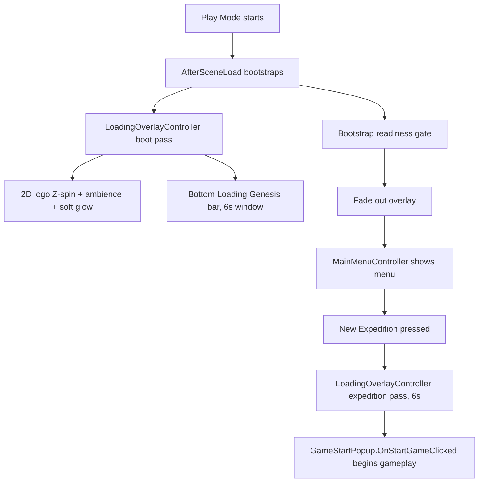

# Dark Matter: Genesis — Loading Screen Plan

**Status:** **Implemented** — `LoadingOverlayController` ships under `Assets/_Project/Scripts/UI/`, runs twice per session (boot + expedition), and the legacy start-screen popup step is retired.

**Canonical plan (source of truth):** this file  
`Assets/_Project/Documentation/Design/UI/DMG_LoadingScreen_Plan.md`

**Static preview:**  
`Assets/_Project/Documentation/Design/UI/DMG_LoadingScreen_Preview.png`

> Cursor `.cursor/plans` has no separate Loading Genesis plan file. If one appears later, treat it as a pointer only — **this Design UI doc wins**.

---

## Goal

**Loading Genesis** overlay that covers Play Mode from the first frame, shows brand + progress while in-scene bootstrap finishes, fades out to the main menu — and runs a second time between the menu and gameplay. No dedicated Loading scene.

## Session flow (locked)

```
Loading Genesis (boot)  →  Start menu  →  Loading Genesis (6s)  →  Gameplay
```

| Pass | Window | Ends by |
|------|--------|---------|
| Boot | 6s, extended up to 4s more while bootstrap checkpoints are unmet (bar holds at 92%) | Fade → main menu |
| Expedition | fixed 6s | Fade → gameplay start |

The window is measured with `Time.realtimeSinceStartup`, **not** `Time.unscaledDeltaTime`. Unity clamps unscaled delta to `Time.maximumDeltaTime`, so during scene bootstrap (frames that take ~1s) the accumulated "6 seconds" stretched to 15–20 real seconds on screen.

- No **start-screen popup** between menu and gameplay. `GameStartPopup` still owns the "begin gameplay" sequence, but its panel is never shown — the expedition loader calls it on completion.
- Progress bar is driven directly by the load window so screen time and fill stay in sync.

---

## Architecture decision: overlay (not a new scene)

| Approach | Verdict |
|----------|---------|
| **In-scene overlay** | **Chosen** — matches current boot idiom |
| Dedicated Loading scene | Rejected for this pass — invents `LoadScene` / Build Settings churn for work that already happens in-place |

**Why overlay fits this project**

- Game boots as **one gameplay scene** with a **code-built menu** via [`MainMenuController`](Assets/_Project/Scripts/UI/MainMenuController.cs) (`[RuntimeInitializeOnLoadMethod(AfterSceneLoad)]` → `EnsureExists()` → `Awake` → `BuildMainMenu()`).
- There is **no** `_Project` `SceneManager.LoadScene` / Addressables boot flow to justify a second scene.
- Overlay can appear on the first Play Mode frame and **gate** the menu until fade-out completes (today the menu builds immediately and can flash under a future loader).



**MainMenuController gate (required)**

- On boot, keep the main menu **hidden / not interactive** until `LoadingOverlayController` signals complete and finishes fade-out.
- Preserve existing pause / `timeScale` menu behavior after handoff.
- Do **not** let `BuildMainMenu()` visually flash under the loader.

---

## Branding allow-list / deny-list

**Allowed**

- Product name: **Dark Matter: Genesis** (and DMI / Dark Matter logo derived from project art)
- Copy: **Loading Genesis...**
- Palette: `DarkMatterGenesisUiPalette` / `ShiftUiTheme` only

**Forbidden on the loading screen**

| Do not use | Notes |
|------------|--------|
| Pi logo / Pi Network marks | Exists at `Assets/_Project/Art/Pi Logo.png` — **do not reference** |
| Wallet / crypto UI | Retired from the boot surfaces entirely — `MainMenuWalletPreviewWidget` (AC / Echoes / CONNECTED) is no longer built by `MainMenuController` |
| Invector branding | No Invector names, logos, or copy |
| “Pioneer Survivor” / legacy product names | Superseded identity |
| Legacy cyan accent `#63C6FF` | Do not reintroduce |

---

## Visual composition (UI stack, back → front)

1. **SolidBackdrop** — full-bleed Image, Dark Navy `#1C2A38` (`DarkMatterGenesisUiPalette.DarkNavy`)
2. **BackgroundArt** — full-bleed `RawImage` of `news-1.jpg` at tunable alpha
3. **Rotating logo + soft glow** — circle-masked Dark Matter artwork spinning on Z, fuchsia glow behind
4. **Progress UI** — track + fill + label **Loading Genesis...**

Composition rules: one loading composition (not a dashboard); atmospheric Io / sci-fi from news art under navy.

### Background art

| Item | Value |
|------|--------|
| Path | `Assets/_Project/Documentation/Design/Art Masters/news/news-1.jpg` |
| Component | `RawImage` (full-bleed, stretch) |
| Default alpha | **0.50** |
| Inspector | `[Range(0.30f, 0.75f)]` serialized field |

### Progress bar + label

| Element | Spec |
|---------|------|
| Track | Slate Gray `#4A4A5A` |
| Fill | Rich Fuchsia `#C02E7A` |
| Accents | Gold `#D4A017` |
| Label | **Loading Genesis...** — Warm Off-White `#EDE9E4` |
| Placement | Near bottom of screen |

### Palette reference

Use `DarkMatterGenesisUiPalette` / `ShiftUiTheme` — not hardcoded one-offs:

- Dark Navy backdrop
- Slate Gray track / chrome
- Rich Fuchsia / Gold progress
- Warm Off-White body text
- Soft Beige-Gray only for muted helper copy if needed

---

## Rotating logo (2D — shipped)

**Decision: 2D UI logo rotating on Z.** The earlier 3D mesh / render-texture rig is **removed** — it added a camera, RenderTexture, procedural meshes, and lights for a boot screen.

| Item | Detail |
|------|--------|
| Source art | `Assets/_Project/Art/DMI_Logo_Transparent.png` (1024² RGBA gold lettermark) → runtime copy `Assets/_Project/Resources/UI/LoadingGenesis_Logo.png` |
| Import | Sprite (2D and UI), `alphaIsTransparency` on, mipmaps off, clamp wrap, uncompressed on the default platform |
| Component | Plain centered `RawImage`, 430², no mask — an inscribed circle clips the outer strokes of the D and I |
| Motion | Slow **Z** rotation, ~12°/s, **unscaled** delta so it spins while `timeScale` is 0 |
| Glow | `ShiftUiTheme.CircleGlow` behind the mark, fuchsia, gentle unscaled pulse |
| Retired | The starfield/planet framed icon and `Dark Matter Logo.jpg` ring art — both baked their own wordmark, which tumbled when spun |

---

## Audio (planned)

- Ambient bed: `Assets/_Project/Audio/Spooky Sci-Fi Atmosphere.wav` (short-lived `AudioSource` owned by the overlay, or thin helper on `GameAudioManager`)
- Fade out ambience with the overlay so gameplay / menu music is unaffected

---

## Implementation status (disk truth)

| Asset / script | Exists? |
|----------------|---------|
| This plan + preview PNG | Yes |
| `news-1.jpg` + `Resources/UI/LoadingGenesis_Background.jpg` | Yes |
| `DMI_Logo_Transparent.png` + `Resources/UI/LoadingGenesis_Logo.png` | Yes |
| `LoadingOverlayController.cs` (boot + expedition passes) | Yes |
| MainMenuController loading gate + `LoadIntoExpedition()` | Yes |
| Loading ambience on `GameAudioProfile` / `GameAudioManager` | Yes |
| 3D logo mesh / prefab | **No** — removed by design |
| Loading overlay prefab | **No** — built in code, matching project idiom |
| Start-screen popup step | **Retired** (`GameStartPopup` panel never shown) |

---

## Files to create / edit (when implementing)

| File | Action |
|------|--------|
| `Assets/_Project/Scripts/UI/LoadingOverlayController.cs` | **Done** — overlay, UI stack, 6s progress window, Z-spin logo, ambience, fade, readiness gate, expedition pass |
| `Assets/_Project/Scripts/UI/MainMenuController.cs` | **Done** — boot gate, wallet chrome removed, `LoadIntoExpedition()` replaces the popup step |
| `Assets/_Project/Scripts/Audio/GameAudioManager.cs` + `GameAudioProfile` | **Done** — loading ambience with fade, unaffected by `timeScale` 0 |
| `ProjectSettings/EditorBuildSettings.asset` | **Done** — `Assets/Pioneer v1.5.5.unity` is the only enabled scene |

Reuse `MenuUiBuilder` + palette helpers where practical so the loader matches main-menu chrome.

---

## Runtime order (as shipped)

1. `BeforeSceneLoad` → `ClaimBoot()` sets the menu gate and raises a DontDestroyOnLoad solid-black early veil so the player camera cannot render on the first frames.
2. `AfterSceneLoad` → gameplay cameras are blacked out (`cullingMask = 0`, solid black clear); full overlay canvas at sorting order 32000: **SolidBlackVeil** → LoadingContent (SolidBackdrop → BackgroundArt → glow + spinning logo → progress).
3. Ambience starts; bar fills over the 6s window, holding at 92% if bootstrap checkpoints (theme, audio, menu, `UIManager`) are unmet.
4. Branded content fades to the black veil (not to the world) → handoff `MainCanvasFlow.Refresh()` under opaque black → cameras restored → **fade in from black** → overlay destroyed.
5. **New Expedition** → `EnsureOpaqueCover()` before menu chrome hides → starter pick if needed → phase `StartPopup`, expedition loader for 6s.
6. Same black-veil handoff → `GameStartPopup.OnStartGameClicked()` starts gameplay under black → fade in from black.

---

## Out of scope (this pass)

- Addressables / multi-scene streaming world loads  
- Replacing Features bootstrap with true async asset loads  
- Pi / wallet / Invector / legacy branding on the loader  
- Tips / lore rotator copy on the loading surface  

---

## Verification checklist

- [ ] Play Mode: solid black from first frames; loader visible; no player-camera flash before/between loads or during fade-in  
- [ ] Handoff fades **in from black** after destination is ready (menu or gameplay) — never fades branded overlay straight onto the world camera  

- [ ] Background: Dark Navy + `news-1.jpg` at default ~50% alpha; inspector clamps 0.30–0.75  
- [ ] Branding: Dark Matter: Genesis / Loading Genesis only — no Pi, wallet, Invector, Pioneer Survivor, cyan accent  
- [ ] Transparent gold DMI mark slow Z-spins with no box or halo edge around it  
- [ ] Bar fills across the full 6s window on both passes; no snap from 0% to 100%  
- [ ] No start-screen popup: New Expedition → loader → gameplay  
- [ ] Menu shows no AC / Echoes / CONNECTED chrome  
- [ ] Progress bar + **Loading Genesis...** use palette colors  
- [ ] Ambience fades with overlay; does not fight menu/gameplay music  
- [ ] Handoff: menu interactive only after fade-out  
- [ ] Unity console: no new errors from loader scripts  

---

## Preview

Open: `Assets/_Project/Documentation/Design/UI/DMG_LoadingScreen_Preview.png`  
Target look: navy + ~50% news art, slowly spinning gold DMI lettermark, fuchsia/gold bar, DM:G identity only. The preview still shows the retired beveled 3D mark — treat the transparent DMI mark + TMP title as current.
