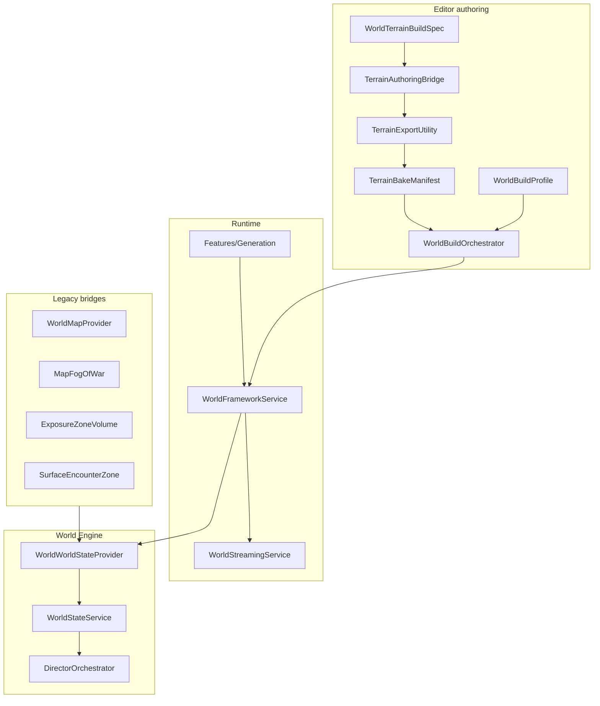

# Genesis World Manager — Full Plan

**Status:** Planning (authoritative for World feature development)  
**Authority:** HLA §2.3 (World), §2.10 (Generation), GDD 5.0 Appendix B, `Io_World_Content_Phase_Map.md` W0–W8  
**Disk truth:** `Assets/_Project/Documentation/Architecture/World_Engine_Disk_Status.md`  
**Framework:** `Dark_Matter_Framework_Engineering_Standard.md`

---

## 1. Executive summary

The **Genesis World Manager** is the Dark Matter: Genesis module responsible for **building, laying out, and activating** the playable Io surface — terrain, biomes, and all world content (enemies, resources, pets, echoes, quests, shards, POIs, hazards).

**Workflow in one sentence:** Designers assign prefabs and tune settings in a `WorldBuildProfile`; the Genesis World Manager procedurally builds geography (via a temporary external terrain authoring tool, then export), scatters gameplay content, and hands off runtime activation to existing systems.

**Critical context:**

| Fact | Implication |
|------|-------------|
| Current flat terrain is **test scaffolding only** | Not the design target; do not architect around it |
| Target is **full Io main map** — **8 km × 8 km** tiled surface, B1–B7 | Streaming, biome masks, and stamp specs from day one |
| **1000 m** is **max peak height** in mountainous biomes only | Lowlands, plains, and caldera floors sit lower; stamps scale per biome |
| External terrain tool used **editor-only**, then **removed from project** | Runtime = vanilla Unity `Terrain` + our assets only |
| **No third-party tool names** in scripts, files, or folders | Neutral names only; tool referenced in this doc where needed |

---

## 2. Vision

### 2.1 What the user does

1. Configure a **terrain build spec** (world size, seed, tile grid, Io biome stamps, platform preset).
2. Build terrain in the external authoring environment (stamps, splats, optional backdrop vegetation).
3. **Export** terrain into `Assets/_Project/World/Terrain/` (project-owned `TerrainData`).
4. Configure a **World Build Profile** — drag prefabs into content layers, set density/weights/rules.
5. Click **Build World** — procedural scatter of enemies, resources, echoes, pets, quests, shards, POIs.
6. **Strip** authoring-tool objects and packages; ship vanilla terrain + DM content only.
7. Play — existing runtime systems activate content on proximity/director rules.

### 2.2 What the Genesis World Manager owns

| Owns | Does not own |
|------|--------------|
| Geography metadata (tiles, bounds, biome regions) | Echo stat rolls (`EchoGenerator` — Generation module) |
| Terrain export manifest and validation | Quest narrative logic (`QuestManager`) |
| Content layer scatter (bake) | Director decision logic (Intelligence layer) |
| Spawn anchor / zone placement | Combat AI behavior |
| WorldState contribution (`PlanetEvolutionSnapshot`, exploration %) | Persistence schema (`GameSaveData` — Core, extended in Run 3) |
| Streaming tile load/unload | LLM / Communications |

### 2.3 Gaia-inspired workflow (planning reference only)

We adopt the **workflow patterns** of industry terrain tools (wizard setup → biome presets → stamp/sculpt → texture → populate → split scenes → stream → iterate) without naming or depending on them at runtime.

| External tool concept | Dark Matter equivalent |
|-----------------------|------------------------|
| Manager wizard | `DmWorldSetupWindow` |
| Biome presets | `BiomeRegionData` + `BiomeLayoutProfile` |
| Height stamps | `TerrainStampProfile` (Io: caldera, ridge, sulfur flat) |
| Splat painting | `TerrainMaterialProfile` |
| Spawner layers | `ContentLayerProfile` (all gameplay content) |
| Scene splitting | `TerrainScenePartitioner` |
| Terrain stitching | `TerrainTileStitchService` |
| World streaming | `WorldStreamingService` |
| Platform presets | `ConsoleTerrainProfile` |
| Editor API bridge | `TerrainAuthoringBridge` (editor-only, optional asmdef) |

---

## 3. Architecture

### 3.1 Module location

```
Assets/_Project/Features/World/
  Runtime/
    IWorldFrameworkService.cs
    WorldFrameworkService.cs
    WorldStreamingService.cs
    TerrainTileRegistry.cs
    BiomeQueryService.cs
    PoiRegistryService.cs
  Data/
    WorldBuildProfile.cs
    WorldTerrainBuildSpec.cs
    TerrainBakeManifest.cs
    BiomeRegionData.cs
    BiomeLayoutProfile.cs
    ContentLayerProfile.cs
    TerrainTileDefinition.cs
    TerrainStampProfile.cs
    TerrainMaterialProfile.cs
    ConsoleTerrainProfile.cs
  Adapters/
    WorldFrameworkBootstrap.cs
    WorldWorldStateProvider.cs
    WorldMapProviderAdapter.cs
    ExposureZoneAdapter.cs
  Editor/
    DmWorldSetupWindow.cs
    WorldBuildOrchestrator.cs
    TerrainScenePartitioner.cs
  Editor/Integrations/TerrainAuthoring/
    TerrainAuthoringBridge.cs
    TerrainExportUtility.cs
    TerrainAuthoringStripUtility.cs
    TerrainAuthoringBridgeWindow.cs
  Tests/
  Documentation/
    Genesis World Manager/
      Genesis World Manager Plan.md   ← this file
```

**Namespaces:** `Project.Features.World`, `Project.Features.World.Adapters`, `Project.Features.World.Editor`, `Project.Features.World.Editor.TerrainAuthoring`

**Companion module (Run 3):** `Assets/_Project/Features/Generation/` — seed system, deterministic rolls, `EchoGenerator` wrap.

### 3.2 Assembly strategy

| Assembly | References | When |
|----------|------------|------|
| `Project.Features.World` | Core, WorldState | Always — **runtime, no external terrain tool** |
| `Project.Features.World.Editor` | World runtime | Always |
| `Project.Features.World.Editor.TerrainAuthoring` | World.Editor + external tool assemblies | **Optional** — only when authoring package present |

Bridge code uses `#if DM_TERRAIN_AUTHORING_BRIDGE` or isolated asmdef so the project compiles cleanly after the external package is removed.

### 3.3 WoOS data flow



### 3.4 Bootstrap order

Unchanged from Framework standard:

`CompanionSystemsBootstrap` → GameState → WorldState → Directors → (Communications)

`WorldFrameworkBootstrap` registers `IWorldFrameworkService` and `WorldWorldStateProvider` during WorldState bootstrap. Directors read snapshots only — never call World services directly.

---

## 4. Terrain pipeline (external tool → project-owned)

### 4.1 World scale target (locked)

| Dimension | Target | Notes |
|-----------|--------|-------|
| **Playable surface** | **8000 m × 8000 m** (8 km × 8 km) | Full Io main map; design maps authored to this extent |
| **Max mountain peak** | **1000 m** | Applies to **mountainous biomes only** (B3 ridges, B4 caldera rims, B6 highlands) — not global floor-to-ceiling span |
| **Lowlands / flats** | Biome-specific (often &lt; 200 m local relief) | B1 sulfur plains, B2 geyser fields, B5 polar flats — stamps use per-biome height caps |
| **Tile grid (recommended)** | **8 × 8** tiles @ **1000 m** per tile | 64 tiles total; clean alignment with 8 km world |
| **Alternate grids** | 16 × 16 @ 512 m, or 4 × 4 @ 2000 m | Use only if console profiling demands different tile size |

**Tile count implications (8 km world):**

| Tile size | Grid | Total tiles | Trade-off |
|-----------|------|-------------|-----------|
| **1000 m** | 8 × 8 | **64** | **Recommended** — matches 8k extent; manageable streaming chunks |
| 512 m | 16 × 16 | 256 | Finer streaming; more stitch seams and Addressable groups |
| 2000 m | 4 × 4 | 16 | Fewer tiles; heavier per-tile memory and LOD cost |

`WorldTerrainBuildSpec` defaults: `worldSizeMeters = 8000`, `tileSizeMeters = 1000`, `gridX = 8`, `gridZ = 8`.

**Phased rollout:** W1 may block out a **subset** (e.g. B6 hub + B1 corridor, 2–4 tiles) before the full 8 × 8 grid ships in W2–W3. Spec and manifest format always assume the **full 8 km extent** as the authoring target.

### 4.2 Design source of truth

| Asset / doc | Role |
|-------------|------|
| `Io_Genesis_World_Map_Geography.md` | Geography authority |
| `Assets/_Project/World/WorldMap/Io_Plan_*.png` | Biome + height reference — map to **8 km × 8 km** extent; peaks up to **1000 m** in mountains |
| `Io_World_Content_Phase_Map.md` W0–W8 | Content production phases |
| `IoSurfaceRegionId` (B1–B7) | Runtime biome enum |

**The current flat `New Terrain.asset` is throwaway test scaffolding.** Gameplay scenes migrate to exported Io tiles when W1 lands.

### 4.3 `WorldTerrainBuildSpec` (ScriptableObject)

Encodes Dark Matter Io requirements; bridge maps to external tool parameters.

| Field | Default / example | Purpose |
|-------|-------------------|---------|
| `worldSeed` | `12345` | Deterministic rebuild |
| `worldSizeMeters` | `8000` | Full playable extent (square) |
| `tileSizeMeters` | `1000` | Per-tile horizontal size |
| `gridX`, `gridZ` | `8 × 8` | Must satisfy `grid × tileSize == worldSize` |
| `targetPlatform` | `Console` | LOD / detail presets |
| `maxMountainPeakMeters` | `1000` | Upper bound for mountainous biome stamps |
| `biomeHeightCaps[]` | Per B1–B7 | Max local relief per biome (most biomes &lt; 1000 m) |
| `biomeStampSets[]` | Per B1–B7 | Region height sculpt |
| `splatProfiles[]` | Per biome | Texture rules |
| `vegetationPass` | `BakeToTerrain` or `ExportScatterIntents` | Backdrop flora handling |
| `playableFlattenZones[]` | B6 hub, colony pad | Flatten masks for build pads |
| `biomeMaskTextures[]` | From `WorldMap/` PNGs | Region stamp masks sampled across 8 km |
| `outputPath` | `Assets/_Project/World/Terrain/` | Export destination |

### 4.4 Authoring bridge (editor-only)

**`TerrainAuthoringBridge`** — thin wrapper; no runtime references.

1. Validate external package present, URP active, spec valid.
2. Create world shell (tile grid per spec).
3. Apply region stamps per biome mask.
4. Run splat pass.
5. Optional backdrop vegetation pass.
6. Stitch and validate seams.
7. Hand off to `TerrainExportUtility`.

Prefer **session-based** rebuilds in the external tool (same spec + seed → same terrain) when available.

### 4.5 Export (`TerrainExportUtility`)

1. Locate all `Terrain` objects from authoring hierarchy.
2. Per tile: copy `TerrainData` → `Assets/_Project/World/Terrain/Io_Tile_{x}_{z}.asset`.
3. Copy terrain layers → `_Project/World/Terrain/Layers/`.
4. Write `TerrainBakeManifest.asset`:
   - Seed, grid, world bounds
   - Per-tile biome dominance
   - Height min/max
   - Tree/detail counts (validation)
5. Reparent under `World/TerrainRoot` (owned hierarchy).
6. Sync `WorldMapProvider` bounds.

### 4.6 Strip (`TerrainAuthoringStripUtility`)

| Step | Action |
|------|--------|
| 1 | Confirm `TerrainBakeManifest` + `_Project` TerrainData refs |
| 2 | Delete authoring tool objects (tools, session, stamper, spawners) |
| 3 | Delete authoring runtime objects (fly cam, third-party water/wind if not ours) |
| 4 | Remove external package folder from `Assets/` |
| 5 | Validate no missing script refs on terrains |
| 6 | Grep `_Project` — `TerrainAuthoring` namespace only in `Editor/Integrations/TerrainAuthoring/` |
| 7 | Console check — zero errors |

**Do not ship:** third-party terrain shaders, third-party water, authoring runtime components.

**Do ship:** vanilla `Terrain` + URP terrain layers + our materials.

### 4.7 Vegetation strategy

| Path | Use when |
|------|----------|
| **A — Bake to Unity terrain** | Backdrop trees/details as standard terrain trees/details |
| **B — Export scatter intents** | Convert placements → `WorldBakeResult` → DM prefabs |

**Gameplay ecology** (Brimstone Fan, Sulfur Hound spawns, etc.) always via `WorldBuildProfile` content layers — not external spawners.

### 4.8 Editor window flow

**Dark Matter → World → Setup**

```
[1] Select WorldTerrainBuildSpec
[2] Validate authoring package (optional step)
[3] Build Terrain               ← TerrainAuthoringBridge
[4] Preview / iterate
[5] Export to Project Assets    ← TerrainExportUtility
[6] Scatter Gameplay Content    ← WorldBuildOrchestrator
[7] Strip Authoring Tool        ← TerrainAuthoringStripUtility
```

Steps 5–7 can be one-click **Finalize World**.

---

## 5. Content layers (prefab + settings → procedural layout)

### 5.1 `WorldBuildProfile` (ScriptableObject)

Master asset per world or biome slice:

| Section | Contents |
|---------|----------|
| **World shell** | References `TerrainBakeManifest`, seed, bounds |
| **Biomes** | `BiomeRegionData[]` for B1–B7 |
| **Content layers** | `ContentLayerProfile[]` — prefab lists + rules |
| **Director hooks** | Weather weights, echo caps, danger budget per biome |

### 5.2 Layer types

Generalizes the existing `SurfaceEncounterTable` weighted-entry pattern to all content:

| Layer type | User assigns | Settings | Bake output | Runtime handler |
|------------|--------------|----------|-------------|-----------------|
| **Enemy** | Combat prefabs | Weight, threat kind, min/max, patrol | `SurfaceEncounterZone` + anchors + table | `SurfaceEncounterZone.TryActivateZone()` |
| **Resource** | `ResourceNode` prefabs | Density, biome filter, tool, yield | Placed `ResourceNode` | Harvest loop |
| **Loot pickup** | `ItemPickup` (shards, scrolls) | Scatter count, rarity weight | `ItemPickup` + `MapMarker` | `ResourceGatherer` → quests |
| **Pet** | `PetDefinition.worldPrefab` | Rare chance, biome gate | `PetWorldAdoptable` | `PetManager` on interact |
| **Echo** | Echo prefabs / seed prefab | Cap, disposition weights | Placed prefab or spawn intent | `EchoDefinitionSeed` / `EchoGenerator` |
| **Quest POI** | Trigger / NPC prefabs | `locationId`, quest bindings | `QuestLocationTrigger`, `QuestGiverNpc` | `QuestManager` notify chain |
| **Shard** | Shard `ItemPickup` | Cluster size, story gate, XP | `ItemPickup` groups | `ItemData.grantsXp` |
| **Prop / POI** | Wrecks, beacons, breaches | Label, scan category | Prefab + `MapMarker` + `ScannableTarget` | `MapRegistry` |
| **Flora / detail** | Trees, grass, rocks | Slope/height mask | Terrain detail / prefab scatter | Static |
| **Hazard** | (profile only) | Pressure mix | `ExposureZoneVolume` | `ExposureStatusService` |

### 5.3 Example layer config

```
Enemy Layer — "B1 Sulfur Hound Pack"
  Prefabs: [Sulfur_Hound, Cinder_Skitter]
  Weights:  [70, 30]
  Count:    min 2, max 5 per zone
  Spacing:  min 8m between anchors
  Biomes:   B1 only
  Patrol:   auto-generate loop routes
  Budget:   CombatZoneController cap

Echo Layer — "Neutral Signal Scatter"
  Prefabs: [Generic_Echo_Seed]
  Count:   1–3 per 500m² cell
  Rules:   IoEchoSignalDirectorPolicy caps
  Disposition: procedural via EchoGenerator

Shard Layer — "AC Shard Clusters"
  Prefabs: [AC_Shard_Pickup]
  Clusters: 3–7 per cluster, 2–4 clusters near B6 hub
  Biomes: B6, B1
```

### 5.4 Build orchestrator (`WorldBuildOrchestrator`)

**Editor bake pass** — per biome cell, per enabled layer:

```
for each cell in biomeMask:
    pick spawn points (Poisson / grid / stamp anchor)
    for each point:
        roll weighted prefab from layer.entries
        validate (slope, clearance, min distance, height band)
        instantiate OR record spawn intent
        wire components (anchors, patrol, map markers, quest IDs)
```

**Determinism:** `worldSeed + cellId + layerId` via `Features/Generation` seed system.

**Post-process:** navmesh sample, map bake, validation report, write `WorldBakeResult.asset`.

### 5.5 Runtime activation

| Content | Bake-time | Runtime |
|---------|-----------|---------|
| Terrain / props / resources | Instantiated | Static |
| Enemies | Zone + anchors; optional pre-place | `SurfaceEncounterZone` on player enter |
| Echoes | Prefab or intent | `EchoSignalSpawner` / director schedule |
| Pets | Prefab placed | `PetWorldAdoptable` |
| Quest triggers | Collider + `locationId` | `QuestLocationTrigger` |
| Shards | `ItemPickup` | Collect once; save tracks |

Directors modulate **when** (danger budget, echo caps); Genesis World Manager defines **where**.

---

## 6. Legacy integration (bridge, don't rewrite)

| Legacy system | Integration |
|---------------|-------------|
| `WorldMapProvider` | `WorldMapProviderAdapter` — bounds + texture from active tiles |
| `MapFogOfWar` | Feed `ExplorationPercent` in `PlanetEvolutionSnapshot` |
| `ExposureZoneVolume` | Hazard layer output; biome pressure overlap |
| `SurfaceEncounterZone` + `SurfaceEncounterTable` | Enemy layer output |
| `EnemySpawner` + `EnemySpawnPoint` | Fixed-count placements (boss arenas) |
| `EnemyGroundUtility` | Ground snap for all spawns |
| `EnemySpawnConfigurator` | Per-zone stat overrides |
| `ResourceNode` + `ResourceNodeDefinition` | Resource layer |
| `ItemPickup` + `ItemData.grantsXp` | Shard / loot layer |
| `PetDefinition` + `PetWorldAdoptable` | Pet layer |
| `EchoDefinitionSeed` + `EchoGenerator` | Echo layer |
| `EchoSignalSpawner` | Runtime echo injection |
| `QuestLocationTrigger` + `QuestGiverNpc` | Quest POI layer |
| `MapMarker` + `ScannableTarget` | Prop / POI layer |
| `IoWorldTransitionRules` | Underground access rules |
| `IoEchoSignalDirectorPolicy` | Echo cap constants for director |
| `MapTerrainSyncUtility` | Fold into export validate step |
| `PioneerTerrainRescue` | Query `IWorldFrameworkService` for height across tiles |

---

## 7. WorldState integration

**`WorldWorldStateProvider`** contributes to `WorldStateSnapshot`:

```csharp
builder.Planet = new PlanetEvolutionSnapshot(
    worldSeed: worldService.Seed,
    explorationPercent: fogAdapter.ExplorationPercent,
    biomeUnlockMask: worldService.BiomeUnlockMask);
```

Also: active biome at player position, loaded tile count (debug), region hazard summary.

Replaces hardcoded zeros in `EnvironmentWorldStateProvider` today.

---

## 8. Data model summary

```
WorldTerrainBuildSpec          # terrain authoring input
TerrainBakeManifest            # terrain export output
WorldBuildProfile              # content scatter input
WorldBakeResult                # content scatter output
BiomeRegionData                # B1–B7 definition
ContentLayerProfile            # per-type prefab + rules
TerrainTileRegistry            # tile grid metadata
ConsoleTerrainProfile          # PS5 / Xbox / PC presets
```

---

## 9. Phased delivery

Aligned with GDD B4 + Io W0–W8. **Terrain-first** — not flat-terrain-first.

### Prerequisite — GDD B4 Run 3: Generation + seed

- `Features/Generation` module
- `worldSeed` in `GameSaveData`
- Deterministic rolls for scatter + echo placement

### Phase A — W0: Data foundations

| Deliverable | Notes |
|-------------|-------|
| `Features/World/` asmdef + services skeleton | No external tool refs in runtime |
| `WorldTerrainBuildSpec`, `TerrainBakeManifest`, `BiomeRegionData` | Data SOs |
| B1–B7 stub biome assets | From design docs |
| `WorldWorldStateProvider` | Real `PlanetEvolutionSnapshot` |
| `TerrainExportUtility` + `TerrainAuthoringStripUtility` | Manual export path first |
| Tests: biome query, manifest validation | EditMode |

**Exit:** Biome at player position in WorldState; export/strip workflow documented and tested.

### Phase B — W1: Main map shell + streaming

| Deliverable | Notes |
|-------------|-------|
| `TerrainAuthoringBridge` automated build from spec | Optional asmdef |
| Multi-tile **8 × 8** grid (1000 m tiles) from `WorldMap/` PNGs | Full 8 km × 8 km Io scale |
| `TerrainTileRegistry` + `WorldStreamingService` | Console streaming |
| `TerrainScenePartitioner` + stitch validation | Addressables per tile |
| B6 highlands hub blockout tile | First playable geography |
| Underground instance pipeline hook | Breach → load (separate service) |
| Map fog sectors tied to tiles | UI bridge |

**Exit:** Player walks across real topology; tiles stream; test flat terrain retired from main scenes.

### Phase C — W0/W2: Content layer bake

| Deliverable | Notes |
|-------------|-------|
| `WorldBuildProfile` + `ContentLayerProfile` | Layer SOs |
| `WorldBuildOrchestrator` | Scatter pass |
| Enemy layer → `SurfaceEncounterZone` factory | Reuse existing runtime |
| Resource + loot + shard layers | Reuse `ResourceNode` / `ItemPickup` |
| Echo + pet + quest POI layers | Reuse existing components |
| `DmWorldSetupWindow` | Unified editor UI |

**Exit:** One biome slice (B6 hub + B1 corridor) fully built from profiles on exported terrain.

### Phase D — W3–W6: Full surface + underground

- Remaining biomes B2–B7
- Strata 1–5 instanced packs
- Void Stitcher / elite encounter tables
- Director biome weights wired

### Phase E — W7–W8: Director tuning + console

- `ExperienceDirector` reads baked zone registry
- Echo caps from `IoEchoSignalDirectorPolicy`
- Weather scoped by biome region
- `ConsoleTerrainProfile` profiling on PS5/Xbox targets

---

## 10. Implementation tickets (first sprints)

| ID | Title | Depends |
|----|-------|---------|
| **DM-WORLD-01** | Create `Features/World` module + asmdef | — |
| **DM-WORLD-02** | `WorldTerrainBuildSpec` + `TerrainBakeManifest` SOs | W01 |
| **DM-WORLD-03** | `BiomeRegionData` + B1–B7 stubs | W02 |
| **DM-WORLD-04** | `TerrainExportUtility` + `TerrainAuthoringStripUtility` | W02 |
| **DM-WORLD-05** | `IWorldFrameworkService` + `BiomeQueryService` | W03 |
| **DM-WORLD-06** | `WorldWorldStateProvider` | W05 |
| **DM-GEN-01** | `Features/Generation` seed + `GameSaveData.worldSeed` | — |
| **DM-WORLD-07** | `TerrainAuthoringBridge` + spec-driven build | W04 |
| **DM-WORLD-08** | `TerrainTileRegistry` + `WorldStreamingService` | W04 |
| **DM-WORLD-09** | `WorldBuildProfile` + `ContentLayerProfile` | W05 |
| **DM-WORLD-10** | `WorldBuildOrchestrator` — enemy + resource layers | W09, GEN-01 |
| **DM-WORLD-11** | Content layers: echo, pet, quest, shard, POI | W10 |
| **DM-WORLD-12** | `DmWorldSetupWindow` unified UI | W07, W10 |

---

## 11. Naming rules

| Rule | Example |
|------|---------|
| Prefix new types with `Dm` or place in `Project.Features.World` | `DmWorldSetupWindow` |
| No third-party tool names in code, files, folders | `TerrainAuthoringBridge` not `*Gaia*` |
| External tool referenced only in planning docs | This file, optional README note |
| Editor bridge in isolated folder/asmdef | `Editor/Integrations/TerrainAuthoring/` |
| Runtime assembly has zero external terrain deps | `Project.Features.World` only |
| Product name for docs | **Genesis World Manager** |

---

## 12. Open decisions

| Decision | Options | Recommendation |
|----------|---------|----------------|
| World extent | Fixed vs scalable | **Locked: 8 km × 8 km** |
| Tile size | 512 m / 1000 m / 2000 m | **1000 m** → 8 × 8 grid (64 tiles); profile on console |
| Mountain peak height | Global vs per-biome | **1000 m max** in mountainous biomes; per-biome caps elsewhere |
| First playable slice | B6 hub only vs B6+B1 corridor | B6 hub + B1 corridor (W2); subset of full 8 × 8 grid |
| Vegetation | Terrain bake vs DM scatter | Both: backdrop bake + gameplay scatter |
| Addressables | Per-tile groups | Yes for console |
| Underground | Same module vs sibling service | `UndergroundInstanceService` under World |
| Authoring package version | Pin in doc when chosen | Document in `TerrainAuthoring/README.md` |

---

## 13. Success criteria

| Milestone | Outcome |
|-----------|---------|
| **M1** | Terrain exported to `_Project/World/Terrain/`; authoring package stripped; zero console errors |
| **M2** | Full or partial **8 km** tiled slice streams; test flat terrain removed from main gameplay scene |
| **M3** | `WorldBuildProfile` populates enemies, resources, echoes, pets, shards, quest triggers on real topology |
| **M4** | Same seed → identical terrain + content layout after rebuild |
| **M5** | `PlanetEvolutionSnapshot` reports real seed, exploration %, biome unlock mask |
| **M6** | Directors read biome-scoped data from WorldState; no direct World service calls |

---

## 14. Out of scope (v1)

- Procedural quest *generation* (placement only)
- ML-assisted layout
- Runtime terrain sculpting
- Dedicated shard collectible system (use `ItemPickup` + `grantsXp` until Aether-9 collectibles)
- Full Io biome art pass (W6+ content track)
- Communications / LLM integration

---

## 15. Recommended first PR

**`DM-WORLD-01` through `DM-WORLD-04`:**

1. `Features/World` module skeleton (runtime + editor, no external deps in runtime).
2. `WorldTerrainBuildSpec`, `TerrainBakeManifest`, `BiomeRegionData` ScriptableObjects.
3. `TerrainExportUtility` + `TerrainAuthoringStripUtility` (manual workflow: build in external tool → export → strip).
4. `Genesis World Manager Plan.md` (this document).

Then **`DM-GEN-01`** (seed persistence) in parallel, followed by **`DM-WORLD-07`** (automated bridge) once export manifest format is stable.

---

*Dark Matter Studios — Dark Matter: Genesis — Genesis World Manager*  
*Last updated: August 2026*
